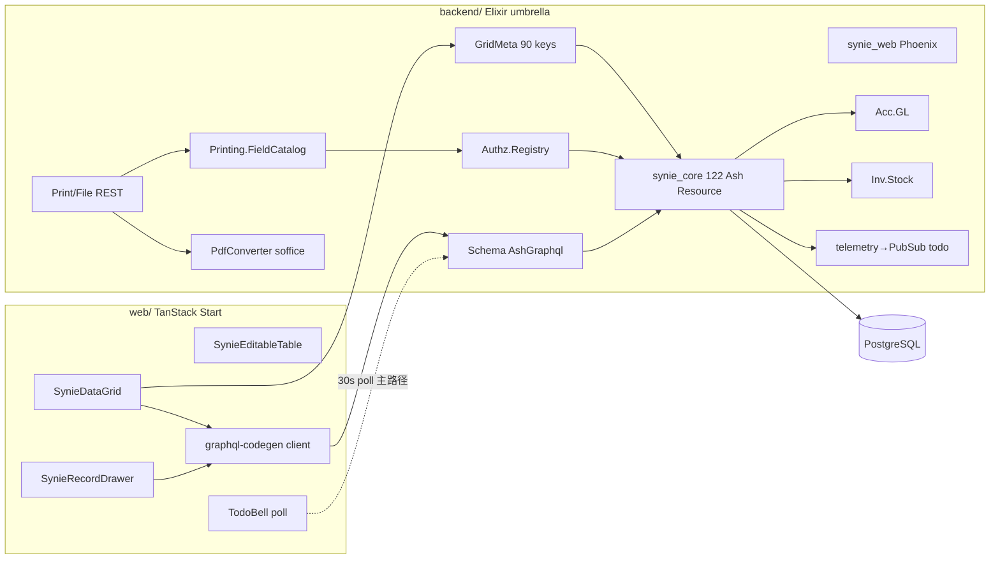
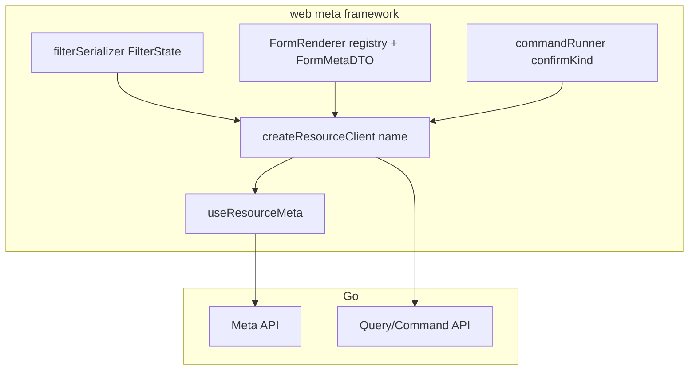
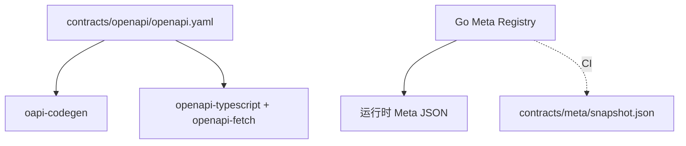
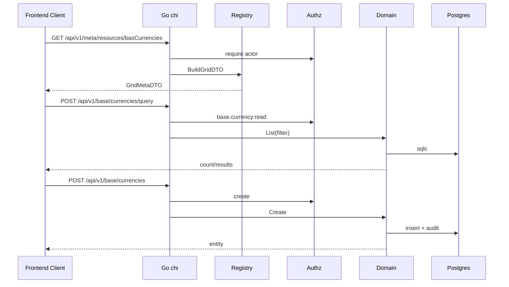
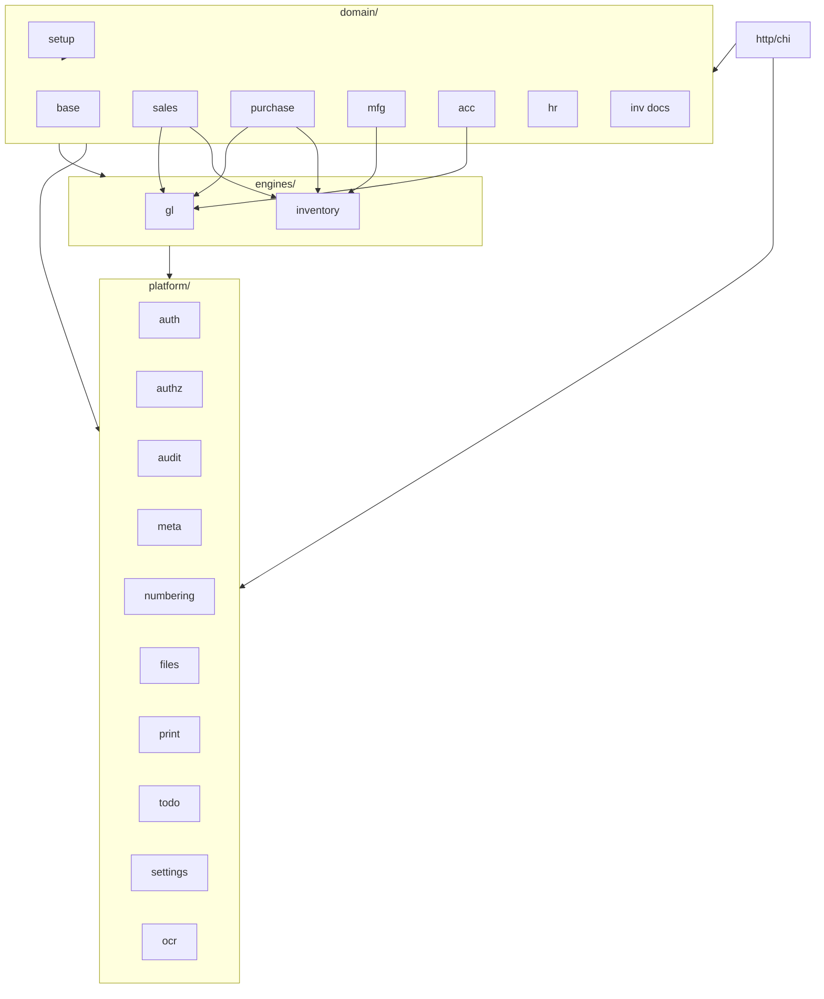
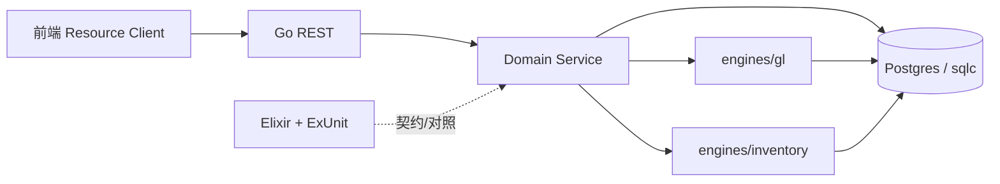

# Synie 全栈元数据框架 + 语言迁移总体规划

| 字段 | 值 |
|------|-----|
| **文档类型** | 架构设计 / 迁移总体规划 |
| **作者** | TBD |
| **日期** | 2026-07-25 |
| **状态** | **Review-approved R3**（未上线；大刀阔斧 / 无双活兼容） |
| **相关** | `CONTEXT.md`、`docs/adr/*`、`docs/产品文档/*`、`docs/adr/2026-07-25-go-fullstack-meta-migration.md` |
| **与既有 ADR 冲突** | 见 [§ 与既有 ADR 的关系](#与既有-adr-的关系)：supersede scaffold 中 GraphQL 与「非 monorepo」定案 |
| **部署前提（R3）** | **系统尚未上线**；无生产用户、无停机窗口约束；**不要求**与 Elixir 双活兼容 |

---

## Overview

Synie 是面向中小企业的多公司财务 ERP。当前后端为 Elixir umbrella（Ash / AshPostgres / AshGraphql / Phoenix / Bandit），前端为 TanStack Start + React 19 + HeroUI + GraphQL。领域已覆盖销售/采购/库存/制造/总账/银行票据发票/HR 等完整链路。

本规划将后端目标语言定为 **Go**，并以**模块化重构式迁移**（非 1:1 翻译）为目标，同时把前后端统一纳入「**全栈元数据框架**」：后端 Go Meta Registry 为资源元数据权威源；前端通过 **Meta 客户端框架**（Grid / Form / Filter / Command 一等公民契约，而非仅换传输层）声明式驱动列表、表单、权限、打印；复杂页允许定制，但仍走统一 Resource Client + Command API。后端重构是先锋站（vanguard），用来验证内核；架构从第一天按全栈元数据框架设计，避免后端迁完前端再推倒。

### 部署前提与策略松绑（R3 · 关键）

| 原 R2 假设 | **R3 定案（未上线）** |
|------------|----------------------|
| 双活 strangler、资源/切片 flag 切流 | **目标栈单写**：产品流量只走 Go+新前端契约；Elixir 仅作**行为参考与契约提取源**，不必长期并行服务用户 |
| Phoenix.Token / Pbkdf2 双栈兼容 | **可换现代 Auth**：JWT 或 PASETO + **argon2id**（或 bcrypt）；demo/开发用户可重置，不必 bit 兼容旧 token/hash |
| 双活期 DDL 仅 Ash | **schema 所有权一次交接**：导出当前 PG schema → **goose 唯一真相**；允许破坏性整理表/索引/辅助函数（删 Ash helper 等） |
| 打印/OCR reverse-proxy 到 Elixir | **直接移植或重写**到 Go；无「proxy 到关停」运维阶段 |
| 停机/回滚/48h 观察 | **不要求**；以测试绿与模块 DoD 为准，开发库可随时 `db reset` |
| 工作量 19–28 人月含双活税 | **下调双活/兼容税**；基线约 **14–22 人月**（仍含领域复杂度） |

**仍保留（与是否上线无关）**：模块边界、Meta 内核、OpenAPI、GL/Inventory 深模块、契约测试、非 1:1 翻译、前端同轴重构。
**仍按模块顺序交付**（Meta → 主数据 → 引擎 → 单据链）——为可测与可维护，**不是**为双活。

**验证后的现状规模（2026-07-25，R1 校正）**：

| 维度 | 数量 |
|------|------|
| `synie_core` 业务代码 | ~50.9k LOC / 189 `.ex` |
| Ash Resource（`use Ash.Resource`） | **122** |
| 声明 `permission_prefix` 的资源 | **100**（`def permission_prefix` 计数，非 104） |
| `GridMeta` 白名单键 | **90** |
| `synie_web` | ~1.3k LOC（GraphQL schema + GridMeta + Print/File REST） |
| 后端测试 | core ~31.6k LOC / 90 files + web ~5.3k / 14 files |
| 前端 TS/TSX | ~46.9k LOC |
| SQL 迁移（Ash/Ecto） | **78**（`priv/repo/migrations/`） |
| Ash `resource_snapshots` | 大树（`priv/resource_snapshots/repo/*`，generate_migrations 真相源） |
| 领域 ADR | 56 篇 |
| 打印子系统 | ~1.99k LOC（`printing/*.ex`，含 Renderer 949 行 + LibreOffice） |
| 最大 Resource 文件 | `vat_invoice.ex` 1147 行；订单/入库/对账等 800–1100 行 |
| 密码算法（现状 Elixir） | Pbkdf2（`$pbkdf2-…`）——**目标栈可换 argon2id，不必兼容**（R3） |
| 登录 Token（现状 Elixir） | Phoenix.Token ——**目标栈可换 JWT/PASETO，不必兼容**（R3） |

**核心痛点**：Ash Resource 把 schema + validation + 审核副作用（GL/Stock）+ GraphQL + policy 捆在同一文件；元数据反射正确但权威源锁在 BEAM 内省，无法跨语言共享。

---

## Background & Motivation

### 当前架构摘要



**已落地的元数据能力**（迁移必须保留并升级）：

| 能力 | 位置 | 行为 |
|------|------|------|
| 权限目录 | `SynieCore.Authz.Registry` | 遍历 `permission_prefix/0`，派生 `域.资源:动作`，不入库 |
| 表格元数据 | `SynieWeb.GridMeta` | 90 键白名单 → 列/枚举/fk/poly-fk + capabilities + extended_actions + destroyMutation |
| 打印字段 | `SynieCore.Printing.FieldCatalog` | 头字段 + has_many 循环区 + party.name；~2k LOC 渲染/转换管线 |
| 审计 | `SynieCore.Audit.Fragment` | create/update/destroy 字段级 diff |
| 编号 | `SynieCore.Numbering.AutoNumber` | create change；`numberableResources` 反射 |
| 文件 | REST `/api/files` + `OwnerRegistry` | 字节 REST；附件 fail-closed |
| 事实引擎 | `Acc.GL` / `Inv.Stock` | 单据审核派生分录；`voucher_resources/0` |
| 待办 | `Sys.Todo` + telemetry→PubSub | 物化提醒；前端 **轮询为主**，PubSub 为增强 |
| 登录 | `Accounts.authenticate` + `Pbkdf2` + `LoginRateLimiter` ETS | 等时失败；5min/10 次 |

**前端元数据驱动组件**（须演进为框架，而非逐页硬编码 REST）：

- `synie-data-grid/` — 列/筛选/排序/能力/扩展动作（`FilterState` 算子全集见附录 D）
- `synie-record-drawer/` — 三态抽屉 + `registry.tsx` fields override（含 `remote.filter` GraphQL 字符串）
- `synie-editable-table/`、`synie-permission-sheet/`、`synie-print/`、`todo-bell`

### 为什么迁移

1. **可维护性**：Resource 巨石；测试厚但与 Ash 生命周期耦合。
2. **人才与生态**：Go 服务端更主流；sqlc 显式 SQL 可审查。
3. **元数据外化**：Ash 内省不能做跨语言契约。
4. **前端可重构**：允许换传输层；必须同时把 Meta/Form/Filter/Command 做成一等公民，避免二次推倒。

### 非目标动机

- 不是为了「更酷的重写」；每阶段可演示 E2E + 契约测试。
- 不是 1:1 翻译 Ash Resource。

---

## Goals & Non-Goals

### Goals

1. **全栈元数据框架**：字段/关系/动作/权限/枚举/列表与表单呈现/筛选 DSL/打印/审计 有后端权威模型；前端有稳定 wire DTO + Resource Client。
2. **后端 Go 先锋**：Meta + Authz + Auth 骨架 + 1 简单资源 E2E 证明全栈内核。
3. **模块边界清晰**：平台横切、事实引擎、业务域，依赖单向。
4. **行为等价迁移**：`CONTEXT.md` + 产品文档 + ExUnit 提炼契约为验收标准。
5. **安全切流**：同 Postgres；**切片级** feature flag + **Write Surface 所有权**（Action / voucher_type / 投影列；共享分录表禁止整表排他）；禁止跨栈写对方拥有的表面。
6. **前端同轴**：阶段 1 即落地 Meta 客户端框架（DTO + filter + resource client），业务页只换适配不重造。

### Non-Goals

1. 不重建完整 Ash DSL / 通用低代码画布。
2. 不在迁移期以 gRPC/protobuf 作主契约。
3. 不改变未定案业务规则（库存估值、行情挂钩定价等）。
4. 不追求复杂零停机多版本 schema 魔法。
5. 不把 Elixir+Go 长期双活当目标架构。
6. 不换 PostgreSQL、不拆微服务库。
7. **OCR / LibreOffice 打印渲染**：迁移期默认可 **反向代理到 Elixir** 直至对应阶段原生移植（见 KD21、§A.7）；非永久 Non-Goal。

---

## Proposed Design

### A. 全栈元数据框架（核心）

#### A.1 原则

| 原则 | 说明 |
|------|------|
| **单一权威源** | Go 进程内 Meta Registry（代码注册）为权威；字段定义不入库（对齐权限点不入库） |
| **契约分层** | **OpenAPI** = HTTP/命令/DTO；**Meta Document** = UI/权限/打印/列表（运行时 JSON） |
| **Authority vs Wire** | `ResourceMeta`（权威、可更丰富）与 `GridMetaDTO`/`FormMetaDTO`（对前端稳定、先兼容 `types.ts`）分离 |
| **声明优先、定制逃生** | CRUD 尽量声明式；单据用 Meta + registry/page override |
| **不复制 Ash** | 校验/状态机/副作用用显式 Service/Command；Meta 描述「有什么、怎么呈现、谁能点」 |
| **fail-closed** | 未注册资源不可 Grid/打印/授权 |

#### A.2 权威模型 ResourceMeta（后端）

```text
ResourceMeta
├── name                 # "basCurrencies"（对齐 GridMeta 键）
├── permissionPrefix     # "base.currency"
├── permissionLabel      # "货币"
├── table                # bas_currency
├── fields[]             # FieldMeta（权威）
├── relations[]
├── actions[]            # 标准十件套 + workflow
├── enums[] / enumRefs
├── list                 # ListHints: defaultSort, hiddenColumns, gridCalculations[]
├── form                 # FormHints: server-optional；见 KD22
├── print                # 是否进打印目录
├── audit                # enabled, sensitiveFields[]
├── numbering            # attribute?
├── aggregates[]         # 公开聚合列
├── destroyAction        # 映射 destroyMutation 名/路径
└── cutoverSlice         # 所属切流切片 ID（见 D.7）
```

**FieldMeta（权威，可宽于 wire）**：

```text
name, apiName (camelCase), dbColumn
type ∈ string|integer|decimal|boolean|date|datetime|enum|enumArray|uuid|json|fk
  # wire 投影时：带 ref 的 uuid/fk → GridColumnType "fk"
label, required, readonly, createOnly, sensitive
enumRef?, decimalScale?
ref?: { resource, relation, labelField }
polyRef?: { discriminator, discriminatorType, variants[] }
filterable, sortable
printPath?
```

**ActionMeta（权威）**：

```text
key, label
kind             # standard | workflow
method, pathTemplate   # POST /api/v1/sales/orders/{id}/audit
scope            # row | bulk | both
isDanger
permission       # 完整码或动作名
confirmKind      # none | generic | audit_doc（对齐「保存并审核」/ useAuditDoc）
wireMutationName # 过渡兼容：旧 GraphQL mutation 名，仅文档/映射用
```

#### A.3 Wire DTO（前端稳定契约）

阶段 1 **必须**先对齐现 `web/app/components/synie-data-grid/types.ts`，再扩展。

**GridMetaDTO**（`GET /api/v1/meta/resources/{name}` → `grid` 字段，或整包兼容旧形）：

```json
{
  "columns": [
    {
      "name": "code",
      "type": "string",
      "label": "编号",
      "sortable": true,
      "filterable": true,
      "enumOptions": null,
      "ref": null
    },
    {
      "name": "active",
      "type": "boolean",
      "label": "启用",
      "sortable": true,
      "filterable": true,
      "enumOptions": null,
      "ref": null
    }
  ],
  "capabilities": ["create", "read", "update", "delete"],
  "extendedActions": [],
  "destroyMutation": "destroyBasCurrency"
}
```

说明：

- `type` 使用前端 `GridColumnType`（含 **`fk`**）。
- `extendedActions[]` 元素在过渡期保留 `mutation` 字符串（兼容 TS）；**同时**下发 `http: { method, path }`；前端 Resource Client 优先 `http`，无则走映射表。
- `destroyMutation` 保留字段名以减 diff；值可为逻辑名，Client 解析为 `DELETE …`。
- **枚举 Chip 颜色**：默认仍 **客户端** map（现状）；服务端不强制下发 color（避免 scope creep）。若某枚举需服务端驱动再扩 `enumOptions[].color`。

**FormMetaDTO**（`form` 字段，阶段 1 可选）：

```json
{
  "exclude": ["insertedAt", "updatedAt"],
  "fields": {
    "code": { "required": true, "edit": "createOnly", "placeholder": "…" },
    "name": { "required": true },
    "companyId": {
      "required": true,
      "remote": { "resource": "basCompanies", "filter": { "active": { "kind": "bool", "eq": true } } }
    }
  },
  "sections": [],
  "tabs": []
}
```

**KD22**：阶段 1–2 **表单主路径仍可前端 `registry.tsx`**；服务端 FormMeta 渐进填充。RemoteSelect 的 `remote.filter` **禁止**再新增 GraphQL 字符串；一律 `FilterState` JSON（见 A.5）。registry 存量 GraphQL filter 在该资源切 REST 时一并改写。

**PermissionCatalogDTO** / **PrintCatalogDTO**：对齐现 catalog / field-catalog JSON 形状（loops + fields）。

#### A.4 Meta Registry（Go）

```go
// internal/platform/meta/registry.go
type Registry struct {
    resources map[string]*ResourceMeta
    byPerm    map[string]*ResourceMeta
}

func (r *Registry) MustRegister(m *ResourceMeta)
func (r *Registry) Get(name string) (*ResourceMeta, bool)
func (r *Registry) Catalog() []PermissionGroup
func (r *Registry) BuildGridDTO(name string, actor *authz.Actor) (*GridMetaDTO, error)
func (r *Registry) BuildFormDTO(name string, actor *authz.Actor) (*FormMetaDTO, error)
func (r *Registry) PrintCatalog(permPrefix string) (*PrintCatalogDTO, error)
```

注册用显式 `RegisterAll`（不用 init 顺序）。复杂业务 **不** 进 Meta。

#### A.5 Filter DSL v1（规范性）

**Filter DSL v1 ≡ 现前端 `FilterState` 的 JSON 同构**（`web/app/components/synie-data-grid/types.ts`），**不**发明新算子集。

| kind | 算子 | 备注 |
|------|------|------|
| text | `contains`, `notContains`, `eq`, `notEq` | |
| bool | `eq` | |
| enum | `values[]` | |
| enumArray | `hasAny`, `notHas` | 参保类型等 |
| number | `eq/gt/lt/gte/lte`, `between` | 值为 **decimal 字符串** |
| date | `eq/before/after`, `between` | `YYYY-MM-DD` |
| fk | `values[]` + labels | |
| polyFk | `in`+variant / `isNil` | Party 等 |

**传输**：列表查询优先 **`POST /api/v1/{domain}/{resources}/query`** body：

```json
{
  "limit": 50,
  "offset": 0,
  "sort": { "column": "isoCode", "direction": "ascending" },
  "filter": {
    "isoCode": { "kind": "text", "op": "contains", "value": "USD" },
    "active": { "kind": "bool", "eq": true }
  }
}
```

简单页可用 GET + 压缩 query；规范以 POST query 为准。

##### A.5.1 Query 构建策略（选定，KD27）

**sqlc 只承担固定路径**（`GetByID`、`Insert`、`Update`、`Delete`、无动态谓词的报表 SQL）。
**列表/RemoteSelect 的任意 filter/sort 不走「为每组合生成 sqlc 查询」**。

选定模式：**Allowlisted predicate builder → 参数化 SQL 字符串 + `[]any` args**（手写小型 builder；可用 `squirrel` 同类库，但列名/算子必须经 Meta 白名单，禁止用户输入进标识符）。

```text
1. 解析 FilterState JSON
2. 对每个 key：查 ResourceMeta.fields[apiName] → dbColumn + type + filterable
3. 未知列 / 类型与 kind 不匹配 → 400 validation
4. 按 kind 生成片段，只拼「已映射的列名」+ 占位符 $n
5. sort.column 同样白名单 → ORDER BY "iso_code" ASC
6. pgx.Query(ctx, "SELECT ... FROM bas_currency WHERE "+where+" ORDER BY ... LIMIT $i OFFSET $j", args...)
```

**货币示例**（`contains` + `eq`）：

```sql
-- filter: isoCode contains "US", active eq true
SELECT id, name, iso_code, symbol, active, inserted_at, updated_at
FROM bas_currency
WHERE iso_code ILIKE '%' || $1 || '%'   -- $1 = "US"（注意转义 %/_ 可选加固）
  AND active = $2                      -- $2 = true
ORDER BY iso_code ASC
LIMIT $3 OFFSET $4;
```

实现包建议：`server/internal/db/filterbuild`（纯函数 + 单测钉全算子）。**禁止**把 filter JSON 直接拼进 SQL。

**RemoteSelect**：`filter` 字段改为同一 `FilterState`；Meta 可注册 **named presets**（如 `activeOnly`）供短声明。

#### A.6 前端元数据框架（一等公民，非传输层置换）



| 构件 | 职责 | 路径建议 |
|------|------|----------|
| **类型** | `GridMeta`/`FilterState` 从 `types.ts` 抽出共享；OpenAPI 生成 DTO 对齐 | `web/src/meta/types.ts` |
| **useResourceMeta** | 替换 `useGridMeta` 的 GQL；staleTime 5min | `web/src/meta/use-resource-meta.ts` |
| **createResourceClient(name)** | `list/query/get/create/update/delete/command` + meta；页面不直接拼 path | `web/src/meta/resource-client.ts` |
| **filterSerializer** | `FilterState` → query body；单测钉算子 | `web/src/meta/filter.ts` |
| **commandRunner** | 读 ActionMeta：`confirmKind=audit_doc` → `useAuditDoc`；Toast 错误 | `web/src/meta/commands.ts` |
| **api-base / flags** | 见 §D.8 Strangler ops | `web/src/meta/routing.ts` |
| **registry.tsx** | 保留 page/form override；逐步可与 FormMeta 合并 | 现路径 |

**「保存并审核」**（`web/AGENTS.md`）：Resource Client `create`/`update` 返回 id；若 meta 含 `audit` 且 capability 具备，Drawer 显示按钮 → `command('audit')` + `confirmKind: audit_doc`。**不**在各业务页复制审核弹窗逻辑。

**阶段 1 验收（前端）**：不仅 `currencies.tsx` 能跑，且 **resource client + filter DSL + meta DTO 类型** 合入主线；后续资源只注册 meta + 改 import。

#### A.7 打印管线（一等风险，非脚注）

现状（~1.99k LOC）：

| 组件 | 文件 | 要点 |
|------|------|------|
| FieldCatalog | `printing/field_catalog.ex` | 权限目录全量；一层 belongs_to；has_many 循环；`party.name`；禁嵌套循环；`_seq` |
| Renderer | `printing/renderer.ex` ~949 行 | xlsx 占位符填充 |
| DocBuilder | `doc_builder.ex` | 装配 |
| PdfConverter | `pdf_converter.ex` | LibreOffice `soffice` headless；进程组超时；孤儿进程 hygiene |
| ConverterLimiter | `converter_limiter.ex` | 并发限制 |
| HTTP | `PrintController` | `GET /api/print/templates`、`field-catalog`、`POST /api/print` |

**Strangler 定案（KD21）**：

1. **阶段 1–3**：Go 暴露 **同路径语义** ` /api/v1/print/*`，**反向代理**到 Elixir（转发 `Authorization`）；前端只改 base path。
2. **FieldCatalog**：Go Meta 实现派生规则；**golden 测试**对照现 print 测试 fixture（占位符校验消息中文一致）。
3. **Renderer 移植**：目标阶段 **2 末–3**（与模板管理、业务打印切流绑定），**不**拖到阶段 5。实现可选：
   - **首选**：Go 原生 xlsx 库重写 Renderer（可控依赖）；
   - **备选**：短期 sidecar 调 Elixir 仅 convert；
   - PDF：Go 同样调 `soffice`，**复制** limiter + 进程组 kill 语义（ADR 打印进程卫生）。
4. 模板在 Elixir 校验通过的占位符集合，在 Go Meta 必须 **超集兼容**（禁止收紧导致旧模板失效）。

**Print 请求 wire（兼容）**：`resource`、`templateId`、`ids[]`、`format: pdf|xlsx`；错误码映射统一 error 模型。

#### A.8 Codegen 路径



刻意不做：从 Meta 生成完整业务逻辑；从 Meta 生成整页 React。

#### A.9 Meta API 与 Command API（序列）



| 层 | 路径 | 用途 |
|----|------|------|
| Meta | `/api/v1/meta/resources`、`…/{name}`、`permission-catalog`、`print-field-catalog` | 元数据 |
| Query | `POST …/query` + REST CRUD | 列表/读写 |
| Commands | `POST …/{id}/{action}` | audit/void/… |
| Binary | `/api/v1/files`、`/api/v1/print` | 文件/打印 |
| Auth | `/api/v1/auth/login`、`/me`（含 **flags**） | 见 KD16 |

---

### B. 模块边界

#### B.1 分层与依赖



**硬规则**：

1. `engines/*` 不得 import `domain/*`。
2. 域间无环依赖；跨域用 `internal/ports`。
3. 平台不依赖 domain/engines。
4. HTTP 只做鉴权/绑定/错误映射。

#### B.2 Go 目录

```text
server/
├── cmd/synie/
├── internal/
│   ├── platform/{auth,authz,audit,meta,numbering,files,print,todo,settings,ocr}/
│   ├── engines/{gl,inventory}/
│   ├── domain/{base,sales,purchase,mfg,acc,hr,inv,setup}/
│   ├── ports/
│   ├── http/          # chi, middleware, handlers, gen/
│   ├── db/            # pgx, sqlc
│   └── jobs/          # market fetch
├── db/{migrations,queries}/   # goose：关停前仅 Go-private；见 KD18
└── go.mod
contracts/openapi/
contracts/meta/
contracts/fixtures/
backend/               # Elixir 过渡
web/
```

#### B.3 平台横切

| 模块 | 现锚点 | Go 职责 |
|------|--------|---------|
| Auth | Phoenix.Token + Pbkdf2 + LoginRateLimiter | **JWT/PASETO + argon2id**（R3 不兼容旧格式） |
| Authz | Actor / Permission.matches / company scope | 算法附录 B；fail-closed |
| Audit | Fragment | service 钩子 |
| Meta | GridMeta + Registry | ResourceMeta + DTO |
| Numbering | AutoNumber | 统一取号 |
| Files | Files/Storage | multipart + adapters |
| Print | §A.7 | proxy → 原生 |
| Todo | Sys.Todo | §B.3.1 |
| Settings | 单行表 | §B.3.2 |
| OCR | `SynieCore.Ocr` Aliyun | 阶段 5 前 **proxy Elixir** 或整切片迁移（KD23） |

##### B.3.1 Todo 与实时

- 待办是 **源单据状态的派生投影**（对账确认→开票/收票），非独立工作流引擎。
- 前端 `TodoBell`：**30s 轮询 + focus 刷新为主**；PubSub 仅增强（当前前端可无 WebSocket）。
- **切流规则**：Todo 读写与 **生产者切片**（sales/purchase reconciliation + vat invoice）同迁；禁止 Go 写发票而 Todo 引擎仍只在 Elixir 且无桥接。
- Todo：随对账/发票模块在 Go 实现物化；前端可继续轮询，可选 PG NOTIFY（不强制 PubSub）。

##### B.3.2 Settings API

单行资源模式：`GET/PATCH /api/v1/sys/setting`、`…/acc/setting`、`…/sales/setting`、`…/mfg/setting`。无 list；无 create/delete。密钥字段 write-only。

#### B.4 事实引擎接口

```go
// engines/gl — 对齐 SynieCore.Acc.GL
func Post(ctx, tx, voucher VoucherRef, lines []EntryLine, opts PostOpts) error
func Cancel(ctx, tx, voucherType, voucherID string) error
func Reverse(ctx, tx, groupID uuid.UUID, opts) error
func ValidateEntries(companyID uuid.UUID, lines []EntryLine, opts) error

// engines/inventory — 对齐 SynieCore.Inv.Stock
func Post(ctx, tx, voucher VoucherRef, lines []StockLine) error
func Cancel(ctx, tx, voucherType, voucherID string) error
// advisory lock (warehouse, material); signed qty; base unit
```

单据禁止直写分录表。`voucher_resources` 注册保留。

**引擎所有权（KD19）**：在任意过账单据切 Go 之前，对应引擎必须已在 Go 落地；**禁止** Go 单据调 Elixir 引擎进程内函数。过渡期：单据仍在 Elixir 则继续用 Elixir GL/Stock。

#### B.5 业务域与非 CRUD 表面清单

| 域/表面 | 内容 | 引擎/备注 |
|---------|------|-----------|
| base | 公司/币种/单位/科目/行情主数据 | chart/series **custom action** |
| market jobs | 定时/手动拉取 | `jobs` + sys_setting |
| inv 主数据 | 分类/物料/仓/单位转换 | |
| inv 单据 | 出入库/调拨/盘点/余额 | Stock |
| sales/purchase 主数据 | 客户/供应商 | |
| sales/purchase 链 | 报价→订单→发货/入库→对账 | GL+Stock；切片切流 |
| 委外 | 发料/入库/清单 | Stock+GL |
| mfg | BOM/需求/工单/产出 | Stock |
| acc | 凭证/银行/票据/发票/报销 | GL；OCR 入口 |
| hr | 员工/考勤导入/工资 | import parsers |
| setup | 向导 + sample_data + `mix synie.demo` 等价 | 全域 |
| authz matrix world | ~2k LOC builders | 测试移植成本单列 |
| print | §A.7 | |
| files/numbering/audit | 横切 | |

迁移清单 PR-0.3 列：`Grid? Print? GL? Stock? CustomAction? Import? OCR? CutoverSlice?`

---

### C. 技术栈选型

#### C.1 后端 Go

| 关注点 | **选定** | 理由 | **否决** |
|--------|----------|------|----------|
| HTTP | **chi v5** | stdlib 风格、主流 | gin 魔改 context；纯 stdlib 成本高 |
| DB | **pgx/v5 + sqlc** | 类型安全 SQL；共享现 schema | gorm/ent/bun 作主路径 |
| 迁移 | **goose 自阶段 0 起唯一 DDL**（从现库 schema baseline） | R3 未上线 | 双活双写 DDL |
| 小数 | **shopspring/decimal** | 对齐业务半位规则 | float64 |
| 校验 | validator + 领域手写 | | 仅靠 DB |
| OpenAPI | 手写/半生成 + **oapi-codegen** | 契约优先 | 纯注解难审 |
| 测试 | testify + testcontainers（或 docker PG） | 真 PG | 纯 mock DB |
| 作业 | goroutine scheduler（行情） | 现量级 | 过早上复杂队列 |
| 日志/观测 | slog + OTEL 方向 | 主流 | |
| **密码** | **argon2id**（推荐）或 bcrypt | 未上线可重置用户；R3 | 强制兼容 Pbkdf2 |
| **Token** | **JWT（HS256/EdDSA）或 PASETO**，Bearer | 简单主流；R3 | 强制兼容 Phoenix.Token |

**Decimal 策略（可执行）**：

| 规则 | 值 |
|------|-----|
| 金额（原币/本币行金额） | `Decimal.round(x, 2)` — Elixir 默认 **half-up（half away from zero）**；Go 必须同模式 |
| 本币单价展示 | 4 位 |
| base 数量 | 6 位 |
| 汇率 | 本币时强制 1 |
| JSON | **string only**；OpenAPI `type: string, format: decimal`；**拒绝 number** |
| 前端 | 展示可暂 `formatAmount`；**任何算术**必须 `decimal.js`（或等价），阶段 1 货币页起引入 |
| 契约 | `contracts/fixtures/amount_chain.yaml` golden（从 order_item 金额链用例提炼）；Go 单测必跑 |

金额链：`amount = round(qty * price, 2)`；`base_amount = round(amount * rate, 2)`；`base_price = round(price * rate, 4)`。

#### C.2 前端

| 关注点 | **选定** | 否决 |
|--------|----------|------|
| React 19 + TanStack Router/Start + Query | 保留 | 换 Next |
| HeroUI / Pro | 保留 | 换 Ant |
| openapi-fetch + openapi-typescript | 替 GQL | 手写无类型 fetch |
| zod | 表单 | 仅后端校验 |
| Meta 框架 §A.6 | 演进 Synie* | 推倒重写 |
| Bun | 保留 | |

#### C.3 仓库形态

- 新后端 **`server/`**；契约 **`contracts/`**；**`backend/`** 过渡并存。
- 渐进 monorepo（非一日根 workspace）。

---

### D. 迁移策略（未上线 · 大刀阔斧 · 单目标栈）

#### D.0 总原则（R3）

| 原则 | 说明 |
|------|------|
| **单写目标** | 产品路径只实现并维护 **Go `server/` + OpenAPI 前端**；不实现双栈切流 flag、Elixir 写禁用 plug、双端口同 Token |
| **Elixir = 只读参考** | 读 ExUnit / 产品文档 / 现库 schema 提炼契约；开发期可起 Elixir **对照行为**，但**不作为上线依赖** |
| **Schema 可重构** | goose baseline 后允许整理命名、删 Ash helper、收紧约束；破坏性变更用 reset + seed/demo 消化 |
| **交付仍按模块序** | Meta/Auth → 主数据 → GL/Stock 引擎 → 业务单据链 → 打印/作业/Setup；每模块 **垂直做完前后端** 再下一模块 |
| **模块 = 事务边界** | 过账单据仍按「整条业务链」建模（发货=Stock+GL+投影同事务），避免半截服务；这是领域完整性，不是双活 |

#### D.1 阶段总览

| 阶段 | 内容 | 前后端 |
|------|------|--------|
| **0** | 边界/清单/契约模板；**goose baseline 接管 schema** | 文档 + 空 `server/` |
| **1** | Meta+Authz+Auth(JWT/PASETO+argon2id) + Resource Client + **货币端到端** | 同轴证明内核 |
| **2** | 用户角色公司权限、主数据、files、numbering、settings | 每资源 REST+Meta |
| **3** | GL/Stock 引擎 + 手工凭证/库存 | 引擎契约测试 |
| **4** | 销采单据链（报价→订单→发货/入库→对账） | 垂直模块 |
| **5** | 委外/制造/银行票据发票/OCR/HR/行情/打印引擎/Setup | |
| **6** | 删除 `backend/` GraphQL 依赖与 Elixir 树（或 `attic/`）；README/CI 只留 Go | 硬化 |

#### D.2 阶段 0

- 总 ADR（已有）、`docs/architecture/modules.md`、资源清单
- `contracts/openapi` 骨架 + `contracts/fixtures`
- **从现库 `pg_dump --schema-only` → `server/db/migrations/00001_baseline.sql`（goose）**；此后只改 goose
- 可选：保留 docker 起旧 backend 仅供对照，不写 CI 主路径

#### D.3 阶段 1（内核证明）

| 后端 | 前端 |
|------|------|
| chi + pgx + sqlc + slog | openapi-typescript + openapi-fetch |
| argon2id + JWT/PASETO login/me | 新 token 存 localStorage（可换键名） |
| Authz Permission.matches + Actor | capabilities 来自 Meta |
| Meta Registry + GridMetaDTO | Resource Client + useResourceMeta + FilterState |
| basCurrencies CRUD + audit | 货币页 100% 新 client |
| seed：admin 用户 | 登录走 Go only |

**验收**：契约测试绿；下一资源只注册 Meta + sqlc + handler，不新造前端轮子。

#### D.4–D.6 阶段 2–5

- 阶段 2：单位/公司/科目/用户角色/物料仓客商；权限矩阵；files；numbering
- 阶段 3：引擎 + 手工单；金额链/库存不变量
- 阶段 4+：按**业务模块**交付完整链（例：销售发货模块 = delivery API + 引擎调用 + 投影 + 前端页）
- 打印：直接移植 FieldCatalog + Renderer + soffice 封装到 Go（无 proxy 阶段）
- OCR/Todo/行情：随所属业务模块实现

#### D.7 模块事务边界（原 CutoverSlice 的领域含义，去掉双活）

过账类模块在 **单一 Go 事务**内完成所有副作用，并在设计上写清所有权：

| 类型 | 含义 | 例（销售发货） |
|------|------|----------------|
| **A. Commands** | REST 动作 | create/update/audit/void |
| **B. 主表** | 单据头行 | `sal_delivery*` |
| **C. 事实表写入** | 按 voucher_type 调用引擎 | Stock/GL `sales.delivery` |
| **D. 投影列** | 仅本模块路径可写 | `shipped_qty` |

引擎（GL/Inventory）为深模块，被多个单据模块调用；**禁止**单据模块直接 SQL 插入分录表绕过引擎。



#### D.8 开发期对照（可选，非产品路径）

| 做法 | 用途 |
|------|------|
| 本地仍可起 Elixir | 抓 gridMeta JSON、跑旧测试核对边界 case |
| 契约 fixture | 从 ExUnit 提炼后 **只在 Go 执行** |
| 禁止 | 前端运行时在 GQL 与 REST 间按 flag 切换写路径 |

#### D.9 完成定义（关停 Elixir）

1. 规划中的业务模块均在 Go 实现并通过契约/E2E
2. 前端无 `graphql` / codegen gql 依赖
3. CI 仅 `server/` + `web/`；`backend/` 删除或归档
4. goose 为唯一迁移；demo/setup 在 Go 可用
5. ADR：Elixir Removed

---

### E. 测试策略

#### E.1 契约提炼

| 资产 | 策略 |
|------|------|
| authz_matrix (~2k world) | 规格化 → Go table-driven + SQL fixture；**PR 单列移植成本** |
| 领域单测 | JSON/YAML fixture → service |
| print tests | FieldCatalog golden |
| amount chain | `contracts/fixtures/amount_chain.yaml` |
| grid filters | FilterState 全算子 contract |
| password | Go argon2id 单测；可选：旧 Pbkdf2 仅当要导入 demo 库时写一次性迁移 |
| token | JWT/PASETO 签发校验单测 |
| Playwright | helpers 改 REST；每模块 happy + 权限拒绝 |

#### E.2 不变量

GL 平衡；库存非负（仓级）；权限 fail-closed；审核闸与下游 void 规则；金额链 round 模式；审计 sensitive；**Write Surface 单写者**（Action/投影列；共享分录按 voucher_type 归属，非整表单写者）。

#### E.3 金字塔

纯函数/权限 → 引擎不变量 → API 契约 → 少量 E2E。

---

### F. 工作量粗估与风险

#### F.1 粗估（R3 · 去掉双活税）

| 阶段 | 人月（约） |
|------|------------|
| 0 文档+清单+goose baseline | 0.3–0.6 |
| 1 骨架+meta 框架+货币 | 1–1.5 |
| 2 主数据+权限+files+print 基础 | 2–3 |
| 3 引擎+库存/凭证+Renderer | 2–3 |
| 4 销采模块 | 3.5–5 |
| 5 委外/制造/票银发票 OCR/HR/setup/demo/Todo | 3.5–5 |
| 6 清场硬化 | 0.5–1 |
| **隐藏表面**（matrix、import、OCR、行情、setup sample、soffice） | **+2–4**（可与 2–5 重叠） |
| **合计** | **约 14–22 人月** |

并行：平台/引擎与主数据可 2 人并行；过账模块建议熟悉领域者串行关键路径。

#### F.2 风险

| ID | 风险 | 严重度 | 缓解 |
|----|------|--------|------|
| R1 | 单据副作用遗漏 | 高 | 模块契约；投影字段断言 |
| R2 | 权限回归 | 高 | matrix 规格移植 |
| R3 | Filter 能力丢失 | 中 | DSL=FilterState 全量 |
| R4 | 半成品可维护性 | 中 | 模块 DoD；禁止「只迁半截过账」 |
| R5 | 计算字段/sqlc | 中 | view 或 API 组装 |
| R6 | 打印/LibreOffice | 高 | 直接移植；limiter |
| R7 | Decimal 不一致 | 中 | golden + half-up |
| R8 | 前端回归 | 中 | meta 框架+E2E |
| R9 | 绕过引擎写分录 | 高 | 引擎唯一写入口 + 代码审查 |
| R10 | 范围膨胀 | 中 | Non-Goals；清单 |
| R11 | Auth 实现粗糙 | 中 | 标准库 JWT/PASETO + argon2id |
| R12 | Schema 混乱 | 中 | goose 唯一；reset 纪律 |

---

## API / Interface Changes

| 现状 | 目标 |
|------|------|
| `POST /graphql` | `/api/v1/...` OpenAPI |
| `gridMeta` | `GET /api/v1/meta/resources/{name}` → GridMetaDTO |
| list GQL | `POST …/query` → `{count,results}` |
| `auditSalOrder` | `POST …/orders/{id}/audit` + ActionMeta |
| `/api/files`、`/api/print` | `/api/v1/files`、`/api/v1/print`（Go 实现） |
| Phoenix.Token Bearer | **JWT 或 PASETO** Bearer（R3） |

错误模型：

```json
{
  "error": {
    "code": "forbidden|validation|not_found|conflict|not_implemented|internal",
    "message": "中文用户可读",
    "fields": { "exchangeRate": ["必填"] }
  }
}
```

分页 offset 保持。未实现的路由直接 404/501，不做「回落 Elixir」。

---

## Data Model Changes

### KD18 Schema 所有权（R3 · 未上线）

| 步骤 | 动作 |
|------|------|
| 1 | 从现开发库 `pg_dump --schema-only`（或 `mix ecto.dump`）生成 **goose baseline** |
| 2 | 起 Go 后 **仅 goose** 变更 schema；允许删 `ash_*` helper、整理索引/约束 |
| 3 | 开发库可 `goose reset` + seed/demo；**无生产数据迁移脚本义务** |
| 4 | `backend/.../migrations` 与 `resource_snapshots` 在关停时整体归档，不再生成 |

可选：若需对照 Elixir，单独库或只读副本，与 Go 开发库分离。

---

## Alternatives Considered

### Alt-1：继续 Elixir/Ash 模块化
优点：零语言迁移。缺点：元数据难外化、招聘。**否决**（用户定 Go）。作 **成本基线**对照。

### Alt-2：1:1 翻译 Resource
否决：重复巨石。

### Alt-3：gRPC 主契约
否决：浏览器与上传不匹配。

### Alt-4：后端迁完再改前端
否决：二次推倒 Meta。

### Alt-5：GORM/Ent
否决：与共享 schema/报表不符。

### Alt-6：gqlgen 保留 GraphQL
否决：与可维护 OpenAPI 冲突。

### Alt-7：仅导出 Ash Meta JSON，业务留 Elixir
优点：前端可先吃 Meta。缺点：不解决后端可维护性。**否决为主路径**；可选作阶段 0 探针。

### Alt-8：永久多语言（新模块 Go / 旧 Elixir）
**否决**（未上线更无理由永久双栈）。

### Alt-9：双活 Strangler（R2）
优点：上线中系统可渐进。缺点：Token/DDL/写表面税高。**R3 因未上线否决为产品路径**；文档保留领域「模块事务边界」思想。

### Alt-10：Atlas 管理 PG
可在 goose baseline 后评估；不阻塞。

---

## Security & Privacy Considerations

| 主题 | 设计 |
|------|------|
| 认证 | Bearer **JWT 或 PASETO**；独立 `AUTH_SECRET`；过期/刷新策略简单即可（如 7d access） |
| 密码 | **argon2id**；等时失败；不区分用户存在 |
| 授权 | 服务端强制；capabilities 仅 UI |
| 公司隔离 | **Appendix G**：`ANY(company_ids)` / super_admin fail-closed |
| 敏感字段 | Meta sensitive；审计不落值 |
| 上传/下载 | 鉴权 + owner 校验 |
| SQL | 参数化 + filter 白名单 |
| 打印 | 鉴权后渲染；禁止匿名 |
| 限流 | 登录 10 次 / 300s（单进程内存或 Redis，按需） |
| 密钥 | OCR/S3 write-only |

---

## Observability

slog JSON（request_id, user_id, latency, route）；OTEL 方向；metrics：HTTP、过账、soffice、job；审计表；单进程 `/healthz`。

---

## Rollout Plan（开发交付，非生产切换）

1. docker-compose：`postgres` + `server`；前端 Vite proxy → Go。
2. 按阶段合并模块；CI：`go test` + `bun test` + 关键 e2e。
3. 开发库随时 reset + demo seed。
4. 全绿后删除/归档 Elixir，更新 README。

---

## 与既有 ADR 的关系

| ADR | 关系 |
|-----|------|
| `2026-07-07-repo-scaffold.md` | **部分 supersede**：GraphQL→OpenAPI；渐进 `server/`+`contracts/` |
| `2026-07-07-permissions.md` | 语义保留；实现换 Go |
| 审计/GL/库存/打印 ADR | 语义/引擎边界保留；实现换语言 |
| 业务 ADR | 规则不变 |

---

## Open Questions

1. **关停后 `backend/`**： monorepo `attic/` 还是 git tag 归档？（默认：`attic/backend-elixir` 一 PR 挪走）
2. **Actor 权限缓存**：默认可每请求查库；热点后再加。
3. **PDF**：默认 in-process LibreOffice + 并发 limiter（对齐现运维经验）。
4. **Token 具体选型**：JWT (HS256) vs PASETO v4 —— 实现时二选一写进 `server` README，不阻塞模块开发。

---

## Key Decisions

| # | 决策 | Rationale |
|---|------|-----------|
| KD1 | 后端 **Go** | 用户定案 |
| KD2 | **非 1:1 翻译**；平台/引擎/域 | 可维护 |
| KD3 | **全栈 Meta**；Go Registry 权威 | 前后端同轴 |
| KD4 | **OpenAPI + REST** 主路径 | 可维护；supersede scaffold GQL |
| KD5 | **pgx + sqlc** | 类型安全 |
| KD6 | **chi** | 主流轻量 |
| KD7 | **shopspring/decimal**；JSON string；half-up 金额链 | 财务正确 |
| KD8 | 目录 **`server/` + `contracts/`**；最终移除 `backend/` | 清晰 |
| KD9 | 前端保留 React/TanStack/HeroUI/Query；**openapi-fetch** | 控制面 |
| KD10 | **演进 Synie\* + Resource Client 框架** | 非纯换传输 |
| **KD11** | **未上线 → 单目标栈**；无双活 flag / 无停机方案 | R3 |
| KD12 | 序：Meta/Authz → 主数据 → 引擎 → 单据模块 | 依赖与可测 |
| KD13 | 测试：契约 + 不变量 + API + E2E | 行为对齐产品文档/ExUnit 意图 |
| KD14 | 打印/权限/Grid **进 Meta** | 单一真相 |
| KD15 | **GL/Inventory 深模块** | 继承 ADR |
| **KD16** | **Auth Token = JWT 或 PASETO**（自选一种实现）；**不**兼容 Phoenix.Token | R3 |
| **KD17** | **密码 = argon2id**（推荐）；demo 用户可 seed 重置；**不**强制兼容 Pbkdf2 | R3 |
| **KD18** | **goose 自始为唯一 DDL**；baseline 后可破坏性整理 | R3 |
| **KD19** | **过账在同一 Go 事务**；单据经引擎写 GL/Stock | 原子性 |
| **KD20** | **Filter DSL v1 = FilterState JSON 同构**；POST query | 不回归 Grid |
| **KD21** | **打印直接在 Go 实现**（FieldCatalog + Renderer + soffice）；无 Elixir proxy 阶段 | R3 |
| **KD22** | **Form：阶段 1–2 可 registry.tsx**；FormMeta 渐进 | 降风险 |
| **KD23** | OCR/Todo/行情随业务模块实现，无 proxy 义务 | R3 |
| **KD24** | 登录限流单进程即可 | 简化 |
| **KD25** | **工作量基线 14–22 人月**（去掉双活税；领域仍重） | 可规划 |
| **KD26** | **模块事务边界** 写清 Commands/主表/引擎写入/投影列；引擎禁止绕过 | 领域完整（非双活） |
| **KD27** | **Filter → Allowlisted predicate builder + 参数化 SQL** | 可维护且防注入 |
| **KD28** | Elixir **仅参考源**；产品前端 **只打 Go API** | R3 |

---

## PR Plan

### Definition of Done（每个业务模块 / 资源）

- [ ] Meta 注册 + GridMetaDTO 契约/快照
- [ ] sqlc + service；过账模块写明事务边界（A/B/C/D）
- [ ] OpenAPI + 生成客户端
- [ ] 前端 Resource Client；去掉该页 GQL
- [ ] 契约测试（含权限拒绝、关键状态机）
- [ ] 投影列仅模块路径可写的测试（如有）
- [ ] API 或 E2E 冒烟
- [ ] 资源清单状态更新

### 第 0 批：规划与 schema 接管

| PR | 内容 | 路径 |
|----|------|------|
| **PR-0.1** | 迁移总 ADR（已有，按 R3 更新） | `docs/adr/2026-07-25-go-fullstack-meta-migration.md` |
| **PR-0.2** | 模块边界 | `docs/architecture/modules.md` |
| **PR-0.3** | 资源清单（122，标 Grid/Print/引擎/模块） | `.scratch/migration/resource-inventory.md` |
| **PR-0.4** | 契约模板 + 金额/权限 fixture 骨架 | `contracts/fixtures/` |
| **PR-0.5** | **goose baseline** 从现库导出 + `server/` 空模块 | `server/db/migrations/`、`server/go.mod` |
| **PR-0.6** | compose：postgres + server；前端 proxy 指向 Go | compose / vite config |

### 第 1 批：全栈 Meta 内核（证明）

| PR | 内容 | 路径 |
|----|------|------|
| **PR-1.0** | Meta DTO + FilterState + Resource Client | `web/app/lib/meta/*` 或 `web/src/meta/*` |
| **PR-1.1** | chi + `/healthz` + config + pgx | `server/cmd/synie` |
| **PR-1.2** | OpenAPI 流水线 + oapi-codegen | `contracts/openapi/` |
| **PR-1.3** | Auth：argon2id + JWT/PASETO login/me + 限流 | `internal/platform/auth` |
| **PR-1.4** | Authz Permission.matches + Actor + 公司范围 | `internal/platform/authz` |
| **PR-1.5** | Meta Registry + BuildGridDTO | `internal/platform/meta` |
| **PR-1.6** | basCurrencies 全栈 + audit | `domain/base` + 货币页 |
| **PR-1.7** | 前端 login/me 走 Go；删对该页的 GQL | `web/app` |
| **PR-1.8** | 契约测试 + 可选 e2e 货币 | `server/..._test.go` |

### 第 2 批：平台与主数据

| PR | 内容 |
|----|------|
| PR-2.1 | 用户/角色/权限矩阵 |
| PR-2.2 | 公司 + user_company |
| PR-2.3–2.4 | 单位、科目树 |
| PR-2.5–2.6 | Files、Numbering |
| PR-2.7 | Print：**Go 内** FieldCatalog + 模板 CRUD（Renderer 可同批或 3.x） |
| PR-2.8 | Settings |
| PR-2.9 | 物料/分类/仓 |
| PR-2.10 | 客户/供应商/员工 |

### 第 3 批：引擎与库存/凭证

| PR | 内容 |
|----|------|
| PR-3.0 | 金额链 golden 执行器 |
| PR-3.1 | engines/gl |
| PR-3.2 | engines/inventory |
| PR-3.3 | 手工凭证 |
| PR-3.4 | 手工出入库/调拨/盘点 + 余额 |
| PR-3.5–3.6 | Print Renderer + PdfConverter |

### 第 4 批：销采模块

| PR | 模块 | 事务要点 |
|----|------|----------|
| PR-4.1 | 销售报价 | 头行档 |
| PR-4.2 | 销售订单 | 无 GL/Stock |
| PR-4.3 | 销售发货 | Stock+GL+shipped_qty |
| PR-4.4 | 销售对账 | 投影 + Todo 可选 |
| PR-4.5–4.8 | 采购镜像 | 报价/订单/入库/对账 |

### 第 5 批：扩展域

委外、制造、银行/票据、发票+OCR、报销、考勤/工资、行情、Setup/demo、Todo。

### 第 N 批：清场

| PR | 内容 |
|----|------|
| PR-N.1 | 前端删除 graphql 与 codegen |
| PR-N.2 | CI/README/AGENTS 仅 Go+web |
| PR-N.3 | 归档或删除 `backend/` |
| PR-N.4 | ADR：Elixir Removed |

---

## Appendix A — basCurrencies GridMetaDTO（示意 + 对拍流程）

> **非 parity 黄金文件。** 字段名以 `SynieCore.Base.Currency` 为准（`isoCode` / `name` / `symbol` / `active`，**没有** `code`）。
> **PR-1.6 合并前强制**：从运行中 Elixir 抓取
> `query { gridMeta(resource: "basCurrencies") { … } }`
> 原文写入 **`contracts/meta/basCurrencies.grid.json`**，CI 对比 Go `BuildGridDTO` 输出（允许 key 排序差异）。下列 JSON 仅作形状参考，**禁止**当测试 oracle 硬编码。

```json
{
  "columns": [
    {
      "name": "isoCode",
      "type": "string",
      "label": "ISO 编码",
      "sortable": true,
      "filterable": true,
      "enumOptions": null,
      "ref": null
    },
    {
      "name": "name",
      "type": "string",
      "label": "货币名称",
      "sortable": true,
      "filterable": true,
      "enumOptions": null,
      "ref": null
    },
    {
      "name": "symbol",
      "type": "string",
      "label": "符号",
      "sortable": true,
      "filterable": true,
      "enumOptions": null,
      "ref": null
    },
    {
      "name": "active",
      "type": "boolean",
      "label": "启用",
      "sortable": true,
      "filterable": true,
      "enumOptions": null,
      "ref": null
    }
  ],
  "capabilities": ["create", "read", "update", "delete"],
  "extendedActions": [],
  "destroyMutation": "destroyBasCurrency"
}
```

---

## Appendix B — Permission.matches 算法（移植自 `permission.ex`）

具体码 `sales.order:audit` 的候选集：

1. `sales.order:audit`（自身）
2. `sales.order:*`（资源通配）
3. `sales.*`（域通配）
4. `*`（全域，仅种子）

`matches?(perms, code)` 当且仅当候选任一 ∈ perms。`super_admin` 在 Actor 层短路为 true。界面不写通配；种子可写。

---

## Appendix C — 列表 Query OpenAPI 片段（示意）

```yaml
paths:
  /api/v1/base/currencies/query:
    post:
      operationId: queryBasCurrencies
      requestBody:
        required: true
        content:
          application/json:
            schema:
              $ref: '#/components/schemas/ListQuery'
      responses:
        '200':
          content:
            application/json:
              schema:
                type: object
                required: [count, results]
                properties:
                  count: { type: integer }
                  results:
                    type: array
                    items: { $ref: '#/components/schemas/Currency' }
components:
  schemas:
    ListQuery:
      type: object
      properties:
        limit: { type: integer, minimum: 1, maximum: 200 }
        offset: { type: integer, minimum: 0 }
        sort:
          type: object
          properties:
            column: { type: string }
            direction: { type: string, enum: [ascending, descending] }
        filter:
          type: object
          additionalProperties: true  # 运行时按列白名单校验
    Decimal:
      type: string
      format: decimal
      pattern: '^-?[0-9]+(\\.[0-9]+)?$'
```

---

## Appendix D — FilterState 算子全集（规范性引用）

见 `web/app/components/synie-data-grid/types.ts`：`TextOp`、`NumberOp`、`DateOp`、`ColumnFilter` 联合类型。Go 编译器按 `kind` 分支；未知 kind → 400 validation。

---

## Appendix E — 模块事务边界检查清单

```text
Module ID: e.g. sales_delivery
Commands (REST):
Owned tables:
Engine writes (voucher_type):
  - inv_stock_entry: …
  - acc_gl_entry: …
Projection columns (only this module updates):
Single-TX description:
Contract tests:
E2E / API smoke:
```

## Appendix F — （R3 历史附录 · 可忽略）

Phoenix.Token / Pbkdf2 双栈兼容细节已 **废弃**。实现用 JWT/PASETO + argon2id。

## Appendix G — Actor 与公司范围 SQL（对齐 `Authz.Actor` / `CompanyScope`）

**Actor 字段**（`SynieCore.Authz.Actor` / `build_actor/1`）：

```text
user_id, username
super_admin: bool      # 绕过一切功能与数据权限
all_companies: bool    # 绕过公司范围（仍受功能权限码约束，除非 super_admin）
permissions: set       # 角色启用权限码（可含通配）
company_ids: []uuid    # 来自 sys_user_company；fail-closed 默认空
```

**读路径 filter**（对齐 `CompanyScope`）：

```sql
-- 资源带 company_id 时附加：
-- super_admin OR all_companies → 不加约束
-- 否则：
AND company_id = ANY($company_ids::uuid[])
-- company_ids 为空且非 bypass → 恒 false（返回空集）
```

**写路径**（对齐 `CompanyAccessible`）：

```text
若 super_admin 或 all_companies → 允许（仍要业务校验公司存在等）
否则 changeset.company_id 必须 ∈ actor.company_ids
否则 403/validation「无权在该公司下操作数据」
```

**Go 建议**：

```go
func (a *Actor) CompanyFilter() (bypass bool, ids []uuid.UUID) {
    if a.SuperAdmin || a.AllCompanies {
        return true, nil
    }
    return false, a.CompanyIDs
}
// list: if !bypass { b.Where("company_id = ANY(?)", ids) } // ids empty → WHERE false
```

全局资源（如 `bas_currency`、无 `company_id`）**不**加公司谓词；权限仍走 `permission_prefix`。
阶段 1 货币页不测公司范围；**PR-2.2** 起契约测试必须覆盖 fail-closed / 甲乙公司隔离。

---

## References

- `CONTEXT.md`
- `backend/AGENTS.md` / `web/AGENTS.md`
- `docs/adr/2026-07-07-repo-scaffold.md`、`…-permissions.md`、`…-gl-entry.md`、`…-stock-ledger.md`、`…-print-*.md`
- `backend/apps/synie_core/lib/synie_core/accounts/changes/hash_password.ex`（Pbkdf2）
- `backend/apps/synie_web/lib/synie_web/auth.ex`（Phoenix.Token）
- `backend/apps/synie_web/lib/synie_web/grid_meta.ex`（90 keys）
- `backend/apps/synie_core/lib/synie_core/authz/permission.ex`
- `backend/apps/synie_core/lib/synie_core/printing/*`
- `web/app/components/synie-data-grid/types.ts`
- `web/app/components/todo-bell.tsx`

---

## Revision History

| 日期 | 版本 | 说明 |
|------|------|------|
| 2026-07-25 | Draft | 初稿 |
| 2026-07-25 | Draft R1 | 审阅全量：双活兼容、CutoverSlice、前端 Meta、Print、Decimal、PR 细化 |
| 2026-07-25 | Draft R2 | Write Surface、Token 二进制、filter builder、Appendix A/G |
| 2026-07-25 | **R3** | **未上线**：取消双活/停机/Token·密码兼容/Ash 独占 DDL；单目标栈；goose 自始接管；JWT/PASETO+argon2id；工作量 14–22 人月；PR Plan 简化 |
