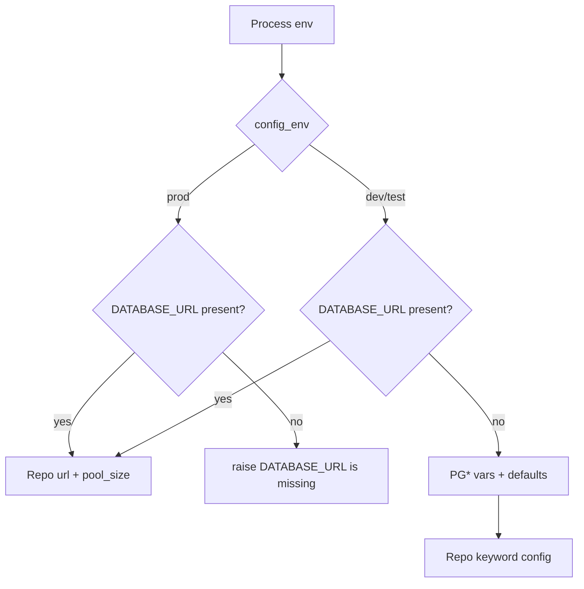

# Synie — 环境变量配置统一管理设计

**日期**: 2026-07-07
**状态**: 已批准（待实现）
**范围**: 后端 env 配置集中化；修正本地 Postgres Docker 暴露端口 `5440` 与代码默认 `5432` 不一致的问题。

## 1. 目标

统一管理后端运行时配置，尤其是 `SynieCore.Repo` 的 Postgres 连接参数。

当前代码在 `backend/config/config.exs` 写死了 `postgres/postgres@localhost:5432/synie_dev`。本地数据库实际由 Docker 暴露在 `localhost:5440`，导致 Repo 启动时连接到错误端口。设计目标是：

- dev 默认连接 `localhost:5440`。
- dev/test/prod 使用同一套 env 解析规则。
- prod 保持强校验，不使用开发默认值。
- 不引入 dotenv 或新的配置依赖。
- 保留现有 Phoenix endpoint 配置边界，不把前端或 HTTP 端口问题混入本次数据库 env 改造。

## 2. 非目标

- 不创建或编排 Docker 数据库容器。
- 不新增顶层 dev 脚本。
- 不实现自动加载 `.env` 文件。
- 不改前端 env 体系。
- 不扩大到认证、迁移生命周期、seed、release 部署脚本。

## 3. 关键决策

| 决策点 | 选择 | 理由 |
|---|---|---|
| 配置入口 | `backend/config/runtime.exs` | Repo 连接、pool、secret 属于运行时配置，适合从 env 读取 |
| 默认端口 | dev/test 默认 `PGPORT=5440` | 对齐当前 Docker 暴露端口，消除连接 `5432` 的错误默认值 |
| 输入格式 | `DATABASE_URL` 优先；否则读取拆分 `PG*` 变量 | 兼容部署平台，也保留本地开发可读性 |
| prod 策略 | `DATABASE_URL` 和 `SECRET_KEY_BASE` 必填 | 避免生产环境误用开发默认值 |
| `.env` 支持 | 只提供 `.env.example`，不自动加载 | Phoenix/Elixir 默认不读 `.env`；引依赖只为本地便利，收益低 |
| Endpoint | dev/test 保持现有 `dev.exs` / `test.exs` | 本次目标是数据库配置；HTTP 端口不扩大范围 |

## 4. Env 合约

### 4.1 数据库变量

`SynieCore.Repo` 支持以下变量：

| 变量 | dev 默认 | test 默认 | prod |
|---|---:|---:|---|
| `DATABASE_URL` | 可选，优先级最高 | 可选，优先级最高 | 必填 |
| `PGHOST` | `localhost` | `localhost` | 不使用拆分默认值 |
| `PGPORT` | `5440` | `5440` | 不使用拆分默认值 |
| `PGUSER` | `postgres` | `postgres` | 不使用拆分默认值 |
| `PGPASSWORD` | `postgres` | `postgres` | 不使用拆分默认值 |
| `PGDATABASE` | `synie_dev` | `synie_test` | 不使用拆分默认值 |
| `POOL_SIZE` | `10` | `10` | 可选，默认 `10` |

优先级：

1. `DATABASE_URL` 存在时，Repo 使用 `url: DATABASE_URL`。
2. `DATABASE_URL` 不存在且环境为 `dev` 或 `test` 时，Repo 使用拆分变量与默认值组装 keyword 配置。
3. `prod` 中缺少 `DATABASE_URL` 时启动失败，错误信息指明缺失变量。

### 4.2 Endpoint 变量

`prod` 继续读取：

- `SECRET_KEY_BASE`：必填。
- `PHX_HOST`：可选，默认 `localhost`。
- `POOL_SIZE`：可选，默认 `10`，用于 Repo。

`dev` 和 `test` 的 Phoenix endpoint 仍由 `dev.exs` 和 `test.exs` 管理：

- dev HTTP port 继续是 `4000`。
- test HTTP port 继续是 `4002`，endpoint 不启动。

## 5. 配置结构

### 5.1 `config.exs`

保留编译期与通用配置：

- `config :synie_core, ash_domains: [SynieCore]`
- `config :synie_web, ecto_repos: [SynieCore.Repo]`
- `SynieWeb.Endpoint` adapter、render errors、pubsub、live view salt
- `config :phoenix, :json_library, Jason`
- `import_config "#{config_env()}.exs"`

移除 Repo 中写死的 username/password/database/hostname/pool_size。Repo 运行时配置只在 `runtime.exs` 设置。

### 5.2 `runtime.exs`

新增小型 helper，职责只限 env 读取与类型转换：

- `env(name, default)`：读取 env，缺失返回默认值。
- `required_env!(name)`：读取必填 env，缺失时 raise 清晰错误。
- `integer_env!(name, default)`：读取整数 env，非法时 raise 清晰错误。
- `repo_config(env)`：根据 `config_env()` 返回 Repo keyword。

实现策略：

- `prod`：`url: required_env!("DATABASE_URL")`，`pool_size: integer_env!("POOL_SIZE", "10")`。
- `dev` / `test`：如果 `DATABASE_URL` 存在，使用 `url`；否则使用 `username/password/database/hostname/port/pool_size`。
- `test` 继续额外配置 `pool: Ecto.Adapters.SQL.Sandbox`，保持现有测试隔离语义。

### 5.3 `.env.example`

新增 `backend/.env.example`，仅记录非敏感本地默认值：

```env
PGHOST=localhost
PGPORT=5440
PGUSER=postgres
PGPASSWORD=postgres
PGDATABASE=synie_dev
POOL_SIZE=10
```

该文件是文档和复制模板，不会被应用自动加载。开发者可用 shell、direnv、docker compose `env_file` 或 IDE run configuration 注入变量。

## 6. 数据流



## 7. 错误处理

- 缺少 prod `DATABASE_URL`：启动失败，提示 `DATABASE_URL is missing`。
- 缺少 prod `SECRET_KEY_BASE`：保持当前启动失败行为，提示 `SECRET_KEY_BASE is missing`。
- `PGPORT` 或 `POOL_SIZE` 非整数：启动失败，提示变量名和值非法。
- dev/test 数据库不可达：Repo 仍会由 Postgrex 输出连接错误；这不是配置解析错误。后续持久化资源需要真实 DB 时再补数据库生命周期。

## 8. 测试策略

实现时先写测试覆盖 env 解析，再改生产配置：

1. dev 无 env 时，Repo 默认端口为 `5440`、库名为 `synie_dev`。
2. test 无 env 时，Repo 默认库名为 `synie_test`，保留 SQL sandbox pool。
3. `DATABASE_URL` 存在时优先于拆分变量。
4. `PGPORT` / `POOL_SIZE` 非整数时返回清晰错误。
5. prod 缺少 `DATABASE_URL` 时失败。

配置 helper 应放在可测试模块中，避免直接测试 `runtime.exs` 脚本副作用。推荐新增小模块 `SynieCore.Config` 或类似名称，`runtime.exs` 只调用该模块。该模块只处理纯数据，不启动 Repo，不连接数据库。

## 9. 文档更新

README 的环境要求部分需要更新：

- 说明本地 Postgres 默认连接 `localhost:5440`。
- 列出 `PG*` 和 `DATABASE_URL` 两种配置方式。
- 说明 `.env.example` 不会自动加载。
- 删除“代码默认连本机 Postgres 5432”的旧描述。

## 10. 验收标准

- `backend/config/config.exs` 不再写死 Repo 连接参数。
- `backend/config/runtime.exs` 统一配置 `SynieCore.Repo`。
- dev 默认 Repo 端口为 `5440`。
- prod 缺少 `DATABASE_URL` 时仍失败。
- 新增测试先失败后通过，覆盖 env 解析规则。
- README 与 `.env.example` 描述一致。
