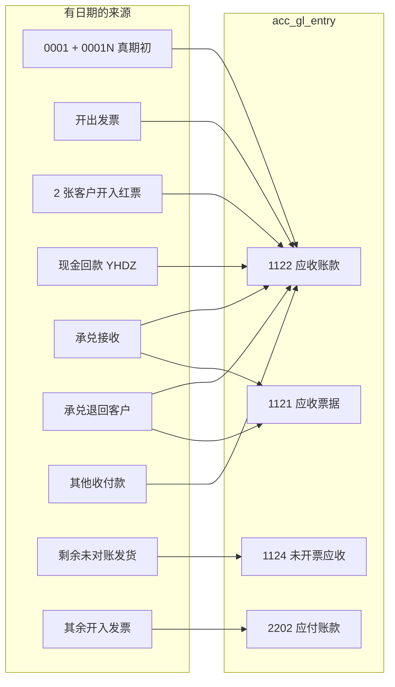

# 简道云迁移账务重放：去掉找平凭证，让任意时点应收应付可回溯

| 项 | 值 |
|---|---|
| 作者 | 迁移账务重放（2026-08-18 设计） |
| 日期 | 2026-08-18 |
| 状态 | Executed（2026-08-19 生产：W1–W8 + 1121 已钉；P2 W7 / P3 D3–D5 未做） |
| 类型 | 数据重放总体规划（含少量产品缝），不是新功能 PRD |
| 读者 | 执行迁移重放的工程师、拍板的业务负责人 |

承接：

- 《[简道云业务数据迁移方案](./简道云业务数据迁移方案.md)》（2026-08-11 定稿，三轨并行 + D11 终态口径）
- 《[简道云业务数据迁移实录](./简道云业务数据迁移实录.md)》（尤其 §18–§27、D11；线上实数以该文为准）
- 《[简道云原始快照](./简道云原始快照.md)》（`data/jdy-source/`）

本方案**不推翻** D11 的今天终态（应收账款科目 1122 = 仪表盘已开票欠款，未开票应收科目 1124 = 发货剩余未对账），只推翻它的**实现手段**：不再用 `A(J)-20200101-0004`～`0008` 把「今天的残差」写在 2020-01-01，改为按已破解的仪表盘公式（`.scratch/align/build_v3_final.py`），用有日期的来源单据重放进 `acc_gl_entry`。今天仍对仪表盘；历史日等于「同一公式截到那天」。报表口径不变：纯总账、`posting_date ≤ asOf`（[ADR 2026-07-16](../系统架构/adr/2026-07-16-ar-ap-report.md)）。

数字凡写「线上」均引自实录或 2026-08-18 已核实生产抽查，**不编造当前余额**。执行时以本地 dump 彩排的实时查询为准。

### 用词对照

| 本文用语 | 术语表 / 产品含义 | 实现 |
|---|---|---|
| 应收账款（1122） | 往来角色 `receivable` 所挂叶子；JT/DF 当前即科目码 1122 | 对仪表盘闸用 `bas_account.code = '1122'`（与 align5 / verify5 相同） |
| 未开票应收（1124） | 往来角色 `unbilled_receivable` | 对剩余未对账闸用 `code = '1124'` |
| 应付账款（2202） | 往来角色 `payable` | 开入发票默认贷方 |
| 应收票据（1121） | **不是**往来角色，**不进**应收应付报表 | 只对科目余额 vs `acc_bill_holding` |
| 作废（void） | 单据终态；发货 void 回滚库存与已发数量 | **本方案禁止**对发货走 void |
| 取消（cancel） | 手工凭证 `AUDITED→CANCELLED`；或 `gl.cancel` 把该来源未作废分录打 `is_cancelled` | 产品路径；整单、不只某一科目行 |
| 物理删除 | 三表 + 审计行 DELETE | **仅**白名单迁移产物，见「ADR 2026-07-09 迁移豁免」 |
| 找平 | 为让今天碰巧等于仪表盘而写在 2020-01-01 的残差凭证 `0004`–`0008` | 删除 |
| 补过账 | 已审核单据补写本该在审核时落下的总账分录 | `backfillPostedGL` → `gl.post` |
| 冲回组 | 发票关联对账单时 1124→1122 的重分类两行 | 历史票不写 |

验收闸一律写清「科目码」还是「角色」。UI 报表按角色轧差；另加一条「角色口径 − 科目口径 = 0」，防止某公司 1122 不是唯一 `receivable` 叶子。

---

## Overview

简道云是余额推导式：仪表盘欠款 = 发票 + 期初 − 流水 − 承兑 − 其他收付款，没有凭证链，没有未开票应收。Synie 是单据链式 + 纯 GL 时点：报表只认 `acc_gl_entry`，`posting_date ≤ asOf`。

当前生产是杂交账。6155 张发票已审核却 0 条 `acc.vat_invoice` 分录；银行回款 6484 张手工凭证按流水日贷了 1122；找平 `0004`–`0008` 把「今天应对齐仪表盘 / 剩余未对账」的差额一次性记在 2020-01-01。后果是任意历史时点不可用：客户 58 京泰在 2020-01-01 出现 1122≈199 万、1124=**−341 万**（2026-08-18 生产抽查）。

本方案选定的干净做法：**按 `build_v3_final.py` 五项公式把有日期的来源单据过账进总账，只保留真正的期初，物理删除全部残差找平。** 不猜订单→发货→对账→发票链，不改报表去读单据，不把找平挪到 cutoff。

**W3（发票）+ W4（承兑往来）+ W6（删 0004–0007）是同一冻结夜的 1122 变异串。** 中间态今天 1122 **不等于**仪表盘（双计：找平还在 + 新发票/新接收已入账）。W3 单独成功不得交回业务。成功标准只有「W6 删完后主集 0 超差」。

产品规则几乎不动：新开票仍强制对账单 + 冲回组；历史已审核无对账单发票走一次性内部补过账（只写往来三行，不写 1124 冲回组）。

---

## Background & Motivation

### 两套模型

| | 简道云 | Synie |
|---|---|---|
| 欠款怎么来 | 仪表盘公式现场加总 | `acc_gl_entry` 按对手×往来角色轧差 |
| 未开票应收 | **没有这个概念** | 发货过账进 1124，开票才 1124→1122 重分类 |
| 日期 | 日期控件几乎全是 `T16:00:00.000Z`（= 中国次日 0 点） | `YYYY-MM-DD`，报表 `posting_date ≤ asOf` |
| 单据链 | 表间无可靠关联键 | 订单→发货→对账→发票→收款，一票一单 |

原迁移方案（2026-08-11）因此否决「AI 清洗后按 synie 正链全量重放」，改走三轨：在途链走 API、已结清用期初找平、归档留档。这个判断**今天仍然成立**。错的是轨道 B 被用过了头：找平从「期初欠款」膨胀成「让今天的 1122/1124 碰巧等于仪表盘」。

### 当前生产杂交账（实录，2026-08-18）

| 块 | 状态 | 出处 |
|---|---|---|
| 增值税发票 | 6155 已审核（JT 5018 / DF 1137；开出 4127 / 开入 2028）；**0 条** `acc.vat_invoice` 分录（align5 已删 align4 的 360 行） | 实录 §3、§9、§24 |
| 银行回款凭证 | 6484 张（6436 单笔 + 48 对内部互转），过账日 = 流水交易日，摘要 `YHDZ …`；6532 笔流水全部 `reconciled` | 实录 §18 |
| 其他收付款 | 46 张手工凭证，备注 `简道云其他收付款:FO-…` | 实录 §19 |
| 承兑交易 | 主档 1038 / 交易 2079 / **持有 31 张 = 1,227,342.56**；贴现 177 已改挂、兑付 153 已对账；85 笔无银行入金兑付不过账；**1121 现为贷方**，与持有不对平 | 实录 §7、§27 |
| 真期初 | `A(J)-20200101-0001`：借 1122 / 贷 3104。JT≈229 万，DF≈523 万。**不含**仪表盘那 7 行负数期初（−177,974.70，在 `queues/opening_ar_negatives.json`） | 实录 §18；`gen_payloads.py` L548 |
| 银行存款补差 | `0002`/`0003`：末笔余额 − 已过账流水净额 | 实录 §18 |
| 找平残差 | `0004` V1；`0005` lookup 归户残余；`0006` 仪表盘口径；`0007` 1122 := 仪表盘（终态）；`0008` 1124 := 剩余未对账 | 实录 §20–§26 |
| 发货 1124 | 原 4889 张走过账进 1124；其余台账不过账。align6 用 `0008` 把已对账仍挂的 1124 一次性冲到 2020-01-01。今天 1124 合计 **2,227,366.96** | 实录 §5、§26 |

D11 拍板的**今天**口径没有错（1122 对仪表盘 297 户 × 京泰/东方 0 超差，verify5；1124 对剩余未对账 0 超差，verify6）。错的是实现。

### 任意时点为什么烂（2026-08-18 生产抽查）

| 时点 | 客户 58 京泰（大连第一） | 解释 |
|---|---|---|
| 2020-01-01 | 1122≈199 万，1124=**−341 万** | `0001` 真期初 + 找平；`0008` 把今天已对账仍挂的 1124 冲在期初，而发货分录在历史发货日 |
| 2026-08-17 | 1122=489,921.69（仪表盘），1124=63,501.00（剩余未对账） | 今天被找平「碰巧」对齐；中间年份不可用 |

### 日期系统性偏一天

`rule_clean.py` 的 `normalize_date` 截 ISO 字符串前 10 位。简道云日期控件 `2019-12-31T16:00:00.000Z` = 中国 2020-01-01 0 点，截 UTC 就变成前一天。

| 对象 | 偏差 | 备注 |
|---|---|---|
| 发票 | 6184/6184 早一天（线上已导入 6155） | `invoice_date` = `posting_date` = 清洗日 |
| 其他收付款 | 45/48 早一天 | 3 张非 T16（`FO-202507030027` / `025` / `024`）保持 |
| 承兑到期日 | 2026-08-18 已按 `iso_cn` 改对 | 实录 §27 |
| 承兑发生日/过账日 | **仍早一天** | 贴现改挂用了 `occurred_on` 入 GL |
| 期初原文 | `2019-12-31T16:00Z` | 凭证日已是 2020-01-01，正确 |
| 银行流水 | 按 Excel 重导，6200/6202 凭证日=流水日 | 少数宁波备份 16:00 占位比回单早一天（实录 §17） |

---

## Goals & Non-Goals

### Goals

1. **任意时点 T**，按对手 × 公司：
   - 应收账款科目 1122(T) = `build_v3_final.py` 五项公式截到 T 的 GL 化（见 Proposed Design）。
   - `T = 今天` 且 **W6 已完成** 时等于仪表盘（V1 / `jdy_targets_v3.csv`）。W3/W4 之后、W6 之前不等于仪表盘。
   - `T = 历史日` 时等于同一公式从 `data/jdy-source/` 重算截到那天。
2. **未开票应收（1124）** 不再靠 `0008`。今天 = 剩余未对账（align6 / verify6 口径）；历史时点 = 「今天仍未对账、且发货日 ≤ T 的那些行」。不编造「2023 年当天的未开票应收」。
3. **应收票据（1121）** 科目借方余额 = 持有 31 张合计 1,227,342.56（按公司拆），白名单外无未作废手工凭证 1121。1121 **不进**应收应付报表，不要拿报表页去对。
4. **应付账款（2202）** 第一次有真实来源：开入发票（除 2 张客户红票）按开票日过账。应付时点 = 开入发票 − 已付供应商款 − 承兑转让 ± 其他（采购入库链不在本方案）。
5. **物理删除** `0004`–`0008`（迁移豁免，见专节）。往来明细里不再出现「期初找平四 三千万」巨行。
6. **全球同一规则**修正从简道云进来的业务日/过账日（`jdyChinaDate`）。**一律不改已有 `doc_no`、不重写 `sys_numbering_counter`。**
7. 全库 Σ借 = Σ贷。验收可脚本化，先本地 dump 彩排。
8. W6 之前打出预演恒等式：主集逐户 `Σ(0004..0007 的 1122) == 将新过账的 1122 净额`。对不上就停，不删找平。

### Non-Goals

- 库存实盘期初（D3）。
- 采购 / 委外全链导入。
- 把历史对账单挂上发票、伪造一票一单。
- 按 synie 正链全量重放。
- 改报表去读单据而不是 GL（违反 ADR 2026-07-16）。
- USD 折算政策。
- 8038 鲸耀等例外户的业务定性（保持来源单据自然账面，**不用找平补**）。
- 恢复 D5 / 关闭 D4——附录待办，与 1124 重放不耦合。

---

## Key Decisions

| # | 决定 | 理由 |
|---|---|---|
| K1 | **按 `build_v3_final.py` 五项公式重放 GL**，不留残差找平 | 已实证 450/451 户复算仪表盘。今天对仪表盘，历史可截日重算 |
| K2 | **只保留 `0001` 作为应收真期初**；7 行负数期初用姊妹凭证 `A(J)-20200101-0001N` 补进真期初（不是找平）。`0001N` 与 W7 银行期初**禁止** `journals.create`（系统取号会变成 `A(J)-20200101-0009`）；与 `0001` 同通道：scratch SQL 插 `acc_gl_journal`/`acc_gl_journal_line` 再 `gl.post` 写分录。`0002`/`0003` 定性为银行期初，W7 可选拆张；**物理删除 `0004`–`0008`** | `0001` 来自简道云期初正数行，本身就是 SQL 直插。`journal-service.ts` L441–442 一律 `numbering.assignedInTx`，内部 seam 不接受传号（ADR 2026-08-06） |
| K3 | **历史发票补过账走 `gl.post` + `invoiceGLEntries`。禁止 `toInput` / `normalizeInput` / `audit`。不伪造对账单、不写冲回组** | `toInput` ≡ `normalizeInput`，无对账单的开出/开入会 400，进不了 `validateReferences` |
| K4 | **1124 冻结日 = 2026-08-17**。取消集 / 重过集只碰 `remarks LIKE '简道云出库:%'`。W5 **唯一**入口是 `backfill_cli.ts --kind delivery-remain`：同一 `withTx` 内 (1) 备注硬闸 (2) `gl.cancel` 整单 (3) `gl.post` 剩余两行 (4) ADR 豁免 DELETE `A(J)-20200101-0008`（白名单 `voucher_no`、对账断言、entry→line→audit→journal）。Scratch SQL 只作 dry-run 预览，**不得**单独 apply。W5 回滚 = 该 CLI 事务回滚 | bun 与 `psql` 各持一连接，不能共享事务。只跑 CLI 则 `1124=剩余+0008`；只先删 `0008` 则 `1124=旧全额` |
| K5 | **承兑：客户收入 = 接收（贷 1122）；客户支出 = 转让给该客户（借 1122 / 贷 1121）；转让给供应商 = 借 2202；贴现/兑付以来源交易为准。客户退回禁止 `createTransaction`+`audit`（会 `replayBill` 打爆已对齐持有）** | 仪表盘承兑是客户类型收入−支出净额；16 户退回 2,454,358.19 必须借回 1122。`audit` 的 `after` 必跑 `replayBill`（`bill-service.ts` L772–773） |
| K6 | **例外户不找平** | 业务定性问题。清单见 §例外户 |
| K7 | **`jdyChinaDate` 全球同一；不改 `doc_no` / 不重写计数器** | `A(I)-YYYYMMDD` 唯一索引非 deferrable。编号与业务日差一天是迁移疤 |
| K8 | **有过账后果走 `gl.post`。找平物理删除是 ADR 2026-07-09 的一次性迁移豁免，与 `gl.cancel` 不可互换** | 见专节。产品路径永远走 cancel |
| K9 | **产品规则不改口径**。补过账不进 UI。CLI 用 `systemPermit('accVatInvoices','audit')` / `systemPermit('accBillTransactions','audit')` / `systemPermit('salDeliveries','audit')` | 动作用现有 `audit` 码，表示补上审核本该写下的分录，不新增 permissionAction |
| K10 | **W3+W4+W6 是同一冻结夜的 1122 变异串**。中间态仪表盘不可用。W3 单独成功不得交回业务 | 今天 1122 已被 `0007` 钉成仪表盘；再过发票必双计，直到删除找平 |
| K11 | **两张开入+客户 lookup 红票（户 56 / 9）改挂往来科目 1122 再按开入过账**；其余开入只进 2202 | 仪表盘把这两张从 1122 减；导入脚本给开入一律挂了 2202 |
| K12 | **85 笔无银行入金兑付：结算科目改 3104，补审计后过账。接受 3104 作为迁移对侧，验收打印 3104 增减表** | 不新开科目。3104 已是 `0001` 对侧。不是 1122 找平 |
| K13 | **W4 后未作废 `acc.gl_journal` 且科目 1121 的分录，白名单只允许 2,217.64 那一笔（及点名对不上的票据补记）** | 漏一笔 YHDZ 就会与交易分录双贷 1121 |
| K14 | **`backfillPostedGL` 与 W5 CLI：`SELECT … FOR UPDATE` 单据行，再数未作废分录；`>0` 则 return。已作废旧行仍允许补过一组。禁止 scratch / Python 直接 `INSERT acc_gl_entry`。W5 必须走 `backfill_cli.ts --kind delivery-remain`，不得私写第二份 bun 脚本** | `gl.post` 不查重；第二次调用就是第二组。现有 scratch 生成器只会出 SQL，调不到 `engines/gl` |
| K15 | **W7 银行期初拆张与 1122/1124 解耦，可另开窗口。新号 `A(J)-<firstTxnMinus1>-BA<账户后缀>`，SQL 直插同 K2，不走 `journals.create`** | 避免和找平删除抢事务；系统取号拿不到指定 `voucher_no` |
| K16 | **客户退回分两路，均不跑 `replayBill`：(a) raw 客户支出对得上已有交易 → 只改 `settle_account_id=1122`（补审计）+ `backfillPostedGL`；(b) 对不上 → SQL 直插 `AUDITED` 的 `ENDORSE`（子票段取该票历史接收段，备注「历史退回客户，持有已对齐，禁止 void/replay」）再只调 `backfillPostedGL`。这些票此后禁止进入任何 `replayBill` / void 路径** | 持有已按实录 §27 对齐成 31 张。对已兑付/贴现段做历史退回会变成「先转后收 / 段不在持有中」（`bill-replay.ts` L76 起） |

---

## Proposed Design

### 终态公式（与 `build_v3_final.py` 同一五项）

已实证（`.scratch/align/v3_recon_report.md`）：

```
应收(对手×公司) = 发票(开出按 7313 lookup 记正；开入带客户 lookup 记负，仅 2 张)
                 + 期初欠款(raw 全量，含 7 行负数；仅剔 9999 测试)
                 − 银行流水(66328 lookup；对方类型∈{其他,供应商,内部划转} 不进；收入正/支出负)
                 − 承兑汇票(raw 全量，客户类型，收入−支出净额，8044 lookup)
                 − 其他收付款(客户类型，2557 lookup，收入正/支出负)
```

GL 化（任意时点 T，应收账款科目 1122）：

```
1122(T) = 真期初 0001（2020-01-01）
        + 真期初补记 0001N（7 行负数，2020-01-01）
        + Σ 开出发票价税(开票日≤T)          // 借 1122
        − Σ 两张客户开入红票价税(开票日≤T)   // 贷 1122；仅户 56、9
        − Σ 客户现金回款(流水日≤T)            // 已有 YHDZ
        − Σ 客户承兑接收(发生日≤T)            // 借 1121 / 贷 1122
        + Σ 客户承兑退回(发生日≤T)            // 借 1122 / 贷 1121
        ± Σ 其他收付款客户往来(业务日≤T)
```

**1122 公式不含其余开入。** 其余开入只出现在 2202(T)。

```
2202(T) = Σ 开入发票价税(开票日≤T，排除上述 2 张)
        − Σ 供应商付款(流水日≤T)
        − Σ 承兑转让给该供应商(发生日≤T)
        ± Σ 其他收付款中的供应商往来(业务日≤T)
```

```
1124(T) = Σ 今天仍未对账、且发货日≤T、remarks LIKE '简道云出库:%' 的发货行
        对手×公司金额 = ROUND(SUM((qty−reconciled_qty)×order_price), 2)   // verify6
```

### 简道云行 → synie 分录

| 简道云行 | synie 来源 | 1122 | 其他科目 | 备注 |
|---|---|---|---|---|
| 期初正数 | `0001` 已有 | 借 1122 | 贷 3104 | 保留 |
| 期初 7 行负数（56 −122,860 / 21 −36,156 / 57 −9,371.50 / 48 −5,565 / 65 −3,022.20 / 123 −500 / 49 −500） | 新凭证 `A(J)-20200101-0001N`（每公司一张） | 贷 1122（金额取绝对值） | 借 3104 | 真期初补记，日期 2020-01-01 |
| 开出发票 | `acc.vat_invoice` + `invoiceGLEntries` | 借 1122 价税 | 贷收入/税 | 6155 中的开出 |
| 开入 + 客户 lookup（户 56、9，共 2 张） | 先 `UPDATE party_account_id` 为该公司 1122，再开入过账 | **贷 1122** | 借金额/税 | 仪表盘从 1122 减 |
| 其余开入 | 开入过账 | 不进 1122 | 贷 2202 | 2028 − 2 张 |
| 未导入 29 张（22 重复票号 + 4 自开 + 3 无法判方向） | 不过账 | 见恒等式 known_gaps | — | 重复票号若 v3 与 6155 已计一次则 gap=0 |
| 客户现金流水 | 已有 `YHDZ` 贷 1122 | 已在 | 借银行 | 不动 |
| 承兑客户收入 | 接收交易 | 贷 1122 | 借 1121 | 433 笔已过；其余补过 |
| 承兑客户支出（退回，16 户 2,454,358.19） | 见 K16：对得上已有交易则只改结算科目；对不上 SQL 直插已审核 `ENDORSE`（禁止 `audit`） | **借 1122** | 贷 1121 | 只走 `backfillPostedGL`，不跑 `replayBill` |
| 承兑供应商支出 | 转让给供应商 | 不进 1122 | 借 2202 / 贷 1121 | |
| 贴现 / 有银行入金兑付 | 承兑交易 | 不进 1122 | 借银行(+利息) / 贷 1121 | 对账挂交易 |
| 无银行入金兑付 85 笔 | 交易 `settle_account`→3104 | 不进 1122 | 借 3104 / 贷 1121 | |
| 其他收付款客户 | 已有 46 张凭证 | 已在 | — | 只改 T16 日期 |
| 找平 `0004`–`0007` | 删除 | 去掉残差 | — | W6，恒等式通过后 |
| 找平 `0008` | 删除 | 不动 1122 | 去掉 1124 残差 | W5 同一事务 |



### W6 之前的预演恒等式（删找平的唯一通行证）

今天 1122 已被 `0007` 钉成仪表盘，所以：

```
删找平后 1122 == 仪表盘
  ⇔  新过账的 1122 净额 == 被删的 0004–0007 对 1122 的净贡献
```

主集逐户逐公司（容差 0.01）：

```
Σ(0004..0007 未作废 1122 分录, 借−贷)
  == Σ(W3 将新过账的发票 1122, 借−贷)
   + Σ(W4 将新过账、此刻尚无未作废分录的接收 1122)      -- 通常为贷
   + Σ(W4 客户退回转让的 1122)                            -- 借
   + Σ(0001N 七行负数的 1122)                             -- 贷
   + known_gaps                                           -- 打印，默认 0
```

`known_gaps` 必须逐项列清单：未导 29 张里 v3 计了而 synie 无票的金额、538 无档票、对不上的票据补记等。主集 gap 合计必须为 0 才许 W6。彩排打出「W3 后 / W6 前」双计差额 = 发票 1122 + 新接收 1122 + 退回 1122 + 0001N，与 `0004–0007` 净贡献对拍。

对不上：**停，不删找平。** 今天业务仍可看仪表盘（找平还在），但窗口未完成、不得宣称成功。

### 什么算真期初，什么算找平

| 凭证 | 处置 | 理由 |
|---|---|---|
| `A(J)-20200101-0001` | **保留** | 业务真期初正数行 |
| `A(J)-20200101-0001N` | **SQL 直插** journal/line（JT/DF 各一张），再 `gl.post` 写 7 行负数。**禁止** `journals.create` | 仪表盘期初分量；不是残差。不改 `0001` 已过账行。系统取号会变成 `0009`，不是 `0001N` |
| `0002` / `0003` | **保留为银行期初**。W7 可选：按账户 SQL 直插 `A(J)-<firstTxnMinus1>-BA00001` 这类号，过账日 = 该户第一笔流水日前一天（不早于 2019-12-31）。同样禁止 `journals.create` | 不是应收找平。工行缺口 −34,175、农商疑漏记 +47,864.95 留档，**不拿 1122 找平补** |
| `0004`–`0008` | **物理删除**（迁移豁免） | 今天碰巧等于仪表盘的残差 |

W7 与 1122/1124 **解耦**，可在主串完成后再做。

### ADR 2026-07-09 迁移豁免（物理删除）

[ADR 2026-07-09](../系统架构/adr/2026-07-09-gl-entry.md)：总账分录只追加；作废 = 标记 `is_cancelled`，不删行。手工凭证产品路径是 `journals.cancel`（头 `AUDITED→CANCELLED`，分录 `gl.cancel`），已对账则拒绝。

本方案对下列凭证做 **一次性物理 DELETE**，正式豁免该 ADR。这与 `gl.cancel` **不可互换**：产品路径永远走 cancel；红冲会让时点更脏（否决 5）。align5 删 align4 是已执行先例，不是常规。

**白名单**（仅这些 `voucher_no`，且 `date = 2020-01-01`）：

- `A(J)-20200101-0004`、`0005`、`0006`、`0007`：W6 scratch apply（1122 恒等式通过后）
- `A(J)-20200101-0008`：**只**由 `backfill_cli.ts --kind delivery-remain` 在与 cancel/post **同一 `withTx`** 里删。Scratch 只 dry-run，禁止单独 apply
- W7 若拆张：旧号 `A(J)-20200101-0002`、`0003`（先插入新号再删旧号）

**删除顺序**（每张凭证，对账断言为 0 之后，同一事务）：

1. 断言 `acc_bank_reconciliation` 中 `voucher_type='acc.gl_journal' AND voucher_id IN (白名单)` 行数为 0（00015 后无 `journal_id` 真 FK，漏检只会留脏对账行，必须显式查）。
2. `DELETE acc_gl_entry WHERE voucher_type='acc.gl_journal' AND voucher_id IN (…)`.
3. `DELETE acc_gl_journal_line WHERE journal_id IN (…)`.
4. `DELETE sys_audit_log`（头 + 行，对齐 align5）。
5. `DELETE acc_gl_journal WHERE id IN (…)`.
6. 断言白名单 `voucher_no` 在 journal / line / entry / audit 均为 0。

业务更正、YHDZ、发货、发票、承兑：**禁止**物理删除，一律 `gl.cancel` / `journals.cancel` / 单据 void（发货除外，发货连 void 都禁止）。

### 日期：`jdyChinaDate`

权威实现入库：`scripts/jdy-replay/china_date.py`。`.scratch/jdy-migration/scripts/rule_clean.py` 的 `normalize_date` **改为 import 该模块**（增量同步只认这一份）。

```python
from datetime import datetime, timezone, timedelta

CST = timezone(timedelta(hours=8))

def jdyChinaDate(iso) -> str | None:
    """T16:00:00.000Z → UTC+8 日历日；其它带时区按 CST；已是 YYYY-MM-DD 不动。"""
    if iso is None:
        return None
    s = str(iso).strip()
    if not s:
        return None
    if "T" not in s:
        return s[:10]
    dt = datetime.fromisoformat(s.replace("Z", "+00:00"))
    return dt.astimezone(CST).date().isoformat()
```

与已用的 `iso_cn` 同一语义。

W1 只 UPDATE 业务日 / 过账日 / 对应 `acc_gl_entry.posting_date`。**断言 `doc_no` 行级未变**（`UPDATE … RETURNING` 前后 `doc_no` 哈希一致）。编号与中国日历差一天视为迁移疤：抽屉可见 `A(I)-20191231-0001` 过账日是 2020-01-01。计数器仍按旧日桶，新开票不和旧号撞。

承兑 `A(B)-`、发货 `S(D)-`、其他收付款 `A(J)-` 同一纪律。

### 发票怎么进 GL

代码事实（`server/src/modules/finance/invoice-service.ts`）：

- `invoiceGLEntries()`：开出借往来/贷收入+税；开入反向。**不读对账单，不写 1124。**
- `reconciliationGLEntries()`：无关联对账单返回 `[]`。
- `toInput` **就是** `normalizeInput`（L437–438）。`normalizeInput` L392–396：开出必须且仅关联销售对账单，开入必须且仅关联采购对账单。历史票两列皆空，**调用 `toInput` 即 400**，到不了 `validateReferences`。
- `validateReferences(..., auditMode=true)` 本身不强制对账单，只校验日期 / 号码 / 恒等式 / 三科目。
- `audit` effect 先 `toInput(invoice)`，故 **不能**抄 `audit` 做补过账。

`backfillPostedGL` 规格：

1. 不进 UI / 不进 `routes.ts` / 不进 meta 新动作。
2. `SELECT … FROM acc_vat_invoice WHERE id=? FOR UPDATE`。
3. `status` 必须是 `AUDITED`；`sal_reconciliation_id` / `pur_reconciliation_id` 必须为空（有关联走正规 `audit`）。
4. `SELECT count(*) FROM acc_gl_entry WHERE voucher_type='acc.vat_invoice' AND voucher_id=? AND is_cancelled=false`。`>0` 则 **return 原票**（幂等）。仅有 `is_cancelled=true` 的旧行（align4 残留若未删净）**允许**再过一组。
5. 用已落库字段组装 `validateReferences` 入参（`direction`/`partyType` 等已是库内规范值）。**禁止** `toInput` / `normalizeInput`。
6. `gl.post({ type:'acc.vat_invoice', id, no: invoice.docNo, companyId, postingDate: invoice.postingDate }, invoiceGLEntries(invoice), { allowNegative: gross<0 })`。
7. 不改 `status`、不 `closeFromInvoice`、不写冲回组。
8. 禁止 scratch SQL `INSERT acc_gl_entry` 躲过以上闸。

两张客户开入红票：彩排 `SELECT id, doc_no FROM acc_vat_invoice WHERE direction='inbound' AND party_type='customer'`（预期 2 张，对手编码 56 / 9）。W3 前 `UPDATE party_account_id` 为该公司 1122，再补过账。

先抽客户 58 京泰（W2，仍属冻结串的可回滚探针，不交回业务），发票净额应对 8,786,057.51（实录 §23）。

### 承兑怎么进 GL

| 类型 | 分录 | 仪表盘 |
|---|---|---|
| 接收 | 借 1121 / 贷 1122（客户） | −承兑（收入） |
| 转让给客户（退回） | 借 1122 / 贷 1121 | −承兑里的支出 = 加回 1122 |
| 转让给供应商 | 借 2202 / 贷 1121 | 不进 1122 |
| 贴现 | 借银行(实收)+5603(利息) / 贷 1121 | 不进 1122 |
| 兑付（有入金） | 借银行 / 贷 1121 | 不进 1122 |
| 兑付（85 笔无入金） | 借 3104 / 贷 1121 | 不进 1122 |
| 调拨 | 不过账 | — |

客户退回 16 户 2,454,358.19（v3_recon_report §2）：20 句容华正 60 万（jt/df 各 30 万）、77 科吉 55 万、26 中互 30 万、15 龙电 15 万(df)、110 奥峰 10 万、16 欧瑞 10 万(df)、21 本色 12 万、119 辽西 102,358.19、103 上九 9 万(df)、56 天际 9.2 万(df)、55 微能汇通 7 万、107 东踞 5 万、22 申泰 5 万、64 微能 5 万、13 墨工 3 万。

**禁止** `createTransaction` + `audit` 建退回（`audit` 的 `after` 必跑 `replayBill`，对已兑付/贴现/再转让的段会变成「先转后收 / 段不在持有中」，打爆实录 §27 已对齐的 31 张持有）。分两路，均只补分录、不重放持有：

1. **已有交易对得上 raw 客户支出**（票号 + 金额 + 对方客户）：只 `UPDATE settle_account_id` 为该公司 1122（补 `sys_audit_log`），再 `backfillPostedGL`（`billTxEntries` 的 `ENDORSE` 形态：借结算科目带客户对手 / 贷 1121）。
2. **对不上**：**禁止** `audit`。scratch SQL 直插 `acc_bill_transaction`，`status='audited'`、`transaction_type='endorse'`、对手=客户、`settle_account_id`=1122、`sub_start`/`sub_end`/`bank_account_id` 取该票**历史接收段**（同一 `bill_id` 的已审核 `receive`）、`doc_no` 手写 `A(B)-<发生日>-RTxxxx`（不碰编号计数器）、`remarks='历史退回客户，持有已对齐，禁止 void/replay'`。然后**只**调 `backfillPostedGL`。

W4 闸：上述直插票的 `bill_id` 不得再进入此后任何 `replayBill` / void 路径（脚本黑名单 + 备注前缀）。持有 31 张在 W4 前后必须逐票号金额不变。禁止用找平代替退回。

贴现/兑付：

- 已改挂的 177+153：分录已在交易上，只改日期；幂等闸会跳过再过。
- 仍挂 `YHDZ` 且实质是贴现/兑付：解除对账 → `journals.cancel`（产品路径，不是 DELETE）→ `backfillPostedGL` → 对账改挂交易。
- **2,217.64**（同票另一段无贴现单）：对账留手工凭证。持有对拍时**单独列出**，1121 科目余额 = 持有合计 + 2,217.64（若该笔仍贷 1121）或按白名单实数。
- 2 张「票据补记」借 1121（111,511.40）：对得上接收则 `journals.cancel` 这两张（无银行对账）；对不上列入 1121 白名单并进 known_gaps，**禁止再补一笔接收双借**。

W4 硬闸：

```sql
-- 未作废手工凭证上的 1121，白名单以外必须为 0
SELECT j.voucher_no, e.debit, e.credit
FROM acc_gl_entry e
JOIN acc_gl_journal j ON j.id = e.voucher_id
JOIN bas_account a ON a.id = e.account_id
WHERE e.voucher_type = 'acc.gl_journal'
  AND NOT e.is_cancelled
  AND a.code = '1121'
  AND j.voucher_no NOT IN (/* 2,217.64 那张；点名补记 */);
```

持有对拍按公司拆，差数逐张票列出。

`backfillPostedGL`（承兑）与发票同构：模块级导出 `billTxEntries`（现为 `createBillService` 内部函数，L605，须上提）；`FOR UPDATE` + 未作废分录则 skip；调拨拒绝；**方法内禁止调用 `replayBill`**。改 `settle_account_id`（85 笔、退回路径 a）必须写 `sys_audit_log`。

### 银行回款

- 客户现金 `YHDZ`（借银行 / 贷 1122）保留，过账日 = 流水日。
- 1121 相关流水按上节拆出。识别键：摘要恰好 20 位数字的收入、含「贴现收入 / 提示付款 / 到期提示付款」、对方栏电子票号、宁波 2021-10 备份五笔空户名提示付款。W4 以白名单闸收口，不靠散文识别。
- 只修点名的日期不一致 + 宁波备份占位日。
- 已对账凭证先解除再 `journals.cancel`。

### 其他收付款

保留 46 张。T16 的改中国日历；`FO-202507030027` / `025` / `024` 保持。承兑互转 2 张、顺丰运费保留。不改 `doc_no`。

### 1124：整单 cancel，按 verify6 重过

冻结日 **2026-08-17**（实录 §25 对账重建冻结；xlsx `未对账销售出库明细_20260817200931.xlsx`）。导入标记：`sal_delivery.remarks LIKE '简道云出库:%'`（`import_all_deliveries.py` L632）。

**同一 Postgres 事务**（W5），**唯一入口** `bun scripts/jdy-replay/backfill_cli.ts --kind delivery-remain --ids-file <取消集+重过集头 id> [--apply]`。CLI 用 `withTx` 包住下列四步（`systemPermit('salDeliveries','audit')`）。金额与尾差由 CLI 按下面 SQL 自己算，不读 scratch 生成的分录 INSERT。**禁止** Python 出 `INSERT acc_gl_entry`。Scratch 里的 `0008` DELETE 只作 dry-run 预览，**禁止** `psql -f` 单独 apply。

事务开头硬闸（必须为 0，否则整窗回滚，不要只靠散文「22218 都有备注」）：

```sql
SELECT count(*) FROM acc_gl_entry e
JOIN sal_delivery d ON d.id = e.voucher_id
WHERE e.voucher_type = 'sales.delivery'
  AND NOT e.is_cancelled
  AND (d.remarks IS NULL OR d.remarks NOT LIKE '简道云出库:%');
```

有未作废 `sales.delivery` 分录却没有该备注的头 = 早期 API 波次漏标，留下全额分录再删 `0008` 会再炸 1124。count>0 则停，先改备注或个案定性，再重跑 W5。

1. 取消集：

```sql
SELECT DISTINCT e.voucher_id
FROM acc_gl_entry e
JOIN sal_delivery d ON d.id = e.voucher_id
WHERE e.voucher_type = 'sales.delivery'
  AND NOT e.is_cancelled
  AND d.remarks LIKE '简道云出库:%';
```

对每个 `voucher_id` 调 `gl.cancel({ type:'sales.delivery', id })`——**整单**所有未作废行（含贷方），不能只打 1124。禁止 `runVoidHead` / void API。

2. 重过集（头级，金额不先 ROUND）：

```sql
SELECT d.id, d.company_id, d.party_type, d.party_id,
       d.debit_account_id, d.credit_account_id,
       d.delivery_date, d.delivery_no,
       SUM((i.qty - i.reconciled_qty) * i.order_price) AS raw_amt
FROM sal_delivery d
JOIN sal_delivery_item i ON i.delivery_id = d.id
WHERE d.status = 'audited'
  AND d.remarks LIKE '简道云出库:%'
GROUP BY d.id
HAVING SUM((i.qty - i.reconciled_qty) * i.order_price) <> 0;
```

按头 `gl.post` **恰好两行**：借 1124（`debit_account_id`，带对手）/ 贷 `credit_account_id`，金额 = 该头 `raw_amt` 再 `roundAmount`（与 `fulfillment/workflow.ts` L112 相同）。同一 `(code, company)` 内按 `delivery_date, id` 排序，**最后一个头吸收** `verify6_party_amt − Σ已过头的 roundAmount`，使

```sql
-- verify6 粒度（对手×公司）
ROUND(SUM((i.qty - i.reconciled_qty) * i.order_price), 2)
```

与未作废 1124 逐户逐公司 0 超差。

3. **仍在该 `withTx` 内**物理删除 `0008`（ADR 豁免，不是 `gl.post`、也不是另一条 `psql`）。白名单仅 `voucher_no='A(J)-20200101-0008'` 且 `date=2020-01-01`；先断言 `acc_bank_reconciliation` 引用为 0；再按专节顺序 `entry → line → audit → journal`。两公司各一张则两张都删。缺凭证或对账非 0 → 整事务回滚。

4. W5 结束闸（仍在同一 `withTx` 末尾查询；失败则回滚）：
   - 上面「非简道云备注却有未作废 delivery GL」count 仍为 0；
   - 未作废 1124 只来自 `sales.delivery`；
   - `0008` 不存在；
   - **有** `简道云出库:%` 备注的头：对手×公司 1124 = verify6 同 SQL **加同一 remarks 谓词**；
   - **无** 该备注的头：1124 发生额与 W5 前快照 0 超差（硬闸为 0 时此条真空为真）。

华采三块只作说明，不是全库谓词。xlsx 与系统单价差 32 元不进 GL。

cutoff 之后正规新发货（无简道云备注）走 `fulfillment` 审核。若窗口内已有这类未作废分录，W5 开头硬闸会失败——先不要混进剩余口径。

### 往来明细观感

| 日期 | 类型 | 金额 |
|---|---|---|
| 2020-01-01 | 手工凭证 `0001` / `0001N` | 该户真期初 |
| 各开票日 | 发票开出 / 发票开入 | 价税 |
| 各回款日 | 手工凭证 `YHDZ` | 回款 |
| 各收票日 | 承兑接收 | 票面 |
| 各退票日 | 承兑转让 | 退回客户加回 1122 |
| 各其他收付款日 | 手工凭证 `简道云其他收付款:FO-…` | 该笔 |
| 未对账发货日 | 销售发货 | 剩余未对账 |

不应再看到 `0004`–`0008` 巨行。

### 例外户（不找平）

| 户 | 已知事实 | 处置 |
|---|---|---|
| 8038 鲸耀 | 公式 −17,490,440；仪表盘无此户 | 发票与回款照常过账。不抹到 0 |
| USD 混币 4 户（200 / 155 / 159 / 12） | 未折算 | 按已过账本币走。不发明汇率 |
| 538 | 无客户档；1 张发票留档 | 不补建、不过该票 GL；进 known_gaps |
| 霍立克 UNMAPPED | 两边无档 | 不动 |
| synie 独有 8xxx 等 | 仪表盘无此户 | 来源单据保持。不找平到 0 |

验收进例外清单，打印账面 / 公式 / 仪表盘三列。

---

## API / Interface Changes

产品对外 API **不变**。

```ts
// invoice-service.ts — 模块级导出
export function invoiceGLEntries(invoice: VatInvoice): GlEntry[]

// 从已落库字段组 validateReferences 入参；禁止调用 toInput / normalizeInput
function auditInputFromPersisted(invoice: VatInvoice): NormalizedInput

backfillPostedGL(permit: Permit, id: string): Promise<VatInvoice>
// FOR UPDATE → 未作废分录>0 则 return → auditInputFromPersisted
// → validateReferences(auditMode=true) → gl.post(invoiceGLEntries)
```

```ts
// bill-service.ts — 从 createBillService 内上提为模块级
export function billTxEntries(tx: BillTransaction): GlEntry[]

backfillPostedGL(permit: Permit, id: string): Promise<BillTransaction>
```

CLI（入库，W2/W3/W4/W5 唯一 TS 执行入口）：

```
bun scripts/jdy-replay/backfill_cli.ts \
  --kind invoice|bill|delivery-remain \
  --ids-file <uuid 列表> \
  --dry-run
```

- 凭证：`systemPermit('accVatInvoices', 'audit')` / `systemPermit('accBillTransactions', 'audit')` / `systemPermit('salDeliveries', 'audit')`（`decide.ts` `systemPermit`；动作用现有 audit，不新增码）。
- `--kind invoice|bill`：逐 id 调 `backfillPostedGL`。
- `--kind delivery-remain`：一个 `withTx` 里顺序执行 (1)「非简道云备注却有未作废 delivery GL」count 闸 (2) 取消集 `gl.cancel({type:'sales.delivery', id})` (3) 按本文 SQL + 户内最后一头吸尾差 `gl.post` 两行 (4) 豁免 DELETE `A(J)-20200101-0008`（对账断言 + entry→line→audit→journal）。CLI 自己查库算金额。Scratch 对 `0008` 只出 dry-run 预览，从不 `--apply`。W5 回滚 = 该事务回滚。
- 只认 `--ids-file` / `--dry-run`。`--apply` 才写。
- `prod-cli.sh` 仍只是 psql 通道，**调不到** `gl.post`。K14 禁止另写第二份 bun 脚本。

测试（`invoice-backfill.postgres.test.ts`）：

1. SQL 直插 AUDITED 无对账单开出 → `backfillPostedGL` → 2/3 行、无 1124、状态仍 AUDITED。
2. 再调一次 → 幂等，分录数不变。
3. 先插入一组 `is_cancelled=true` 的旧 `acc.vat_invoice` 行 → 仍允许补过一组未作废分录。
4. 带 `salReconciliationId` → 拒绝。
5. `DRAFT` → 拒绝。
6. 误调 `toInput` / `normalizeInput` 对无对账单票必须 400；正式路径测试用 spy / 源码约定不得调用。
7. 正规 `audit` 回归：有对账单仍写冲回组。

承兑：接收 / 贴现含利息 / 调拨拒绝 / 幂等 / 已作废行仍可补。`backfillPostedGL` 测试断言未调用 `replayBill`。

`delivery-remain`：夹具一头有全额 `sales.delivery` 分录且备注 `简道云出库:%`，另有一张 `A(J)-20200101-0008` → 同一事务提交后旧组 `is_cancelled`、新组两行金额 = 剩余、`0008` 三表不存在；中途闸失败（备注不匹配却有分录 / 对账引用非 0）→ 整事务回滚，旧组仍在、`0008` 仍在。

---

## Data Model Changes

无 schema 迁移。

| 动作 | 方式 |
|---|---|
| 发票 / 承兑 / 发货补过账 | `gl.post` 只追加 |
| 旧发货 GL、错误 YHDZ 1121 | `gl.cancel` / `journals.cancel` |
| `0004`–`0007`、W7 旧 `0002`/`0003` | 物理删除（豁免；W6 / W7 scratch apply） |
| `0008` | 物理删除（豁免；**仅** W5 CLI 同一 `withTx`，scratch 只预览） |
| `0001N`、W7 新银行期初 | scratch SQL 插 journal/line（指定 `voucher_no`，不走 `journals.create`）+ `gl.post` 写分录 |
| 日期 / 85 笔结算科目 / 2 张红票往来科目 | `UPDATE` + `sys_audit_log` |
| 对账换挂 | `acc_bank_reconciliation.voucher_*` |

---

## Alternatives Considered

### 否决 1：继续留找平，只改日期 +1 天

救不了时点。58 在 2020-01-01 的 1124=−341 万与日期无关。

### 否决 2：把找平挪到 2026-08-30，历史回款不再进 1122

任意时点只在 cutoff 后正确。用户不要找平。

### 否决 3：按 synie 正链全量重放

原方案已否决：无可靠关联键、不是一票一单、猜链生成真实 GL 更危险。

### 否决 4：改报表去读单据

违反 ADR 2026-07-16。

### 否决 5：红冲找平

期初同时出现 +3000 万与 −3000 万，时点更脏。确认是迁移产物时整删更干净，但必须走正式豁免，不能当成和 `gl.cancel` 同类。

### 对比

| | 找平（现状） | 来源单据重放 |
|---|---|---|
| 今天 1122（W6 后） | 等于仪表盘 | 等于仪表盘 |
| W3–W6 中间 | 等于仪表盘 | **不等于**（双计，冻结） |
| 历史 1122 | 不可用 | 截日公式 |
| 抽屉 | 期初巨行 | 发票 / 回款 / 收票 / 退回 / 发货 |

---

## Security & Privacy Considerations

- 生产写库只走已授权窗口。CLI / SQL 默认 dry-run。
- `backfillPostedGL` 无 UI。CLI 用 `systemPermit`，不给普通角色开「无对账单过账」。
- 物理删除仅白名单；对账断言无真 FK，必须显式 SELECT。
- dump 落 `.scratch/`，不入库。

---

## Observability

| 信号 | 闸 |
|---|---|
| W6 **之后** 今天 1122 vs `jdy_targets_v3.csv` | `bas_account.code='1122'`，主集 >0.01 失败 |
| 角色口径 vs 科目口径 | 同一 asOf、`receivable` 轧差 − 1122 科目 = 0 |
| 预演恒等式（W6 前） | 逐户 0004–0007 == 新过账净额 |
| 截日 1122 vs `formula_asof.py` | 主集 0 超差 |
| 今天 1124 | JDY 备注头 = verify6 + `remarks LIKE '简道云出库:%'`；非 JDY 头 vs W5 前快照 0 超差；非 JDY 却有未作废 delivery GL 必须为 0 |
| 1121 科目余额 vs 持有 | 按公司；白名单 2,217.64 单独列。**不对报表页** |
| 未作废 journal 1121 | 白名单外 = 0 |
| 3104 增减表 | 0001N + 85 笔兑付，打印 |
| Σ借=Σ贷 | 全库未作废 |
| 发票分录覆盖 | 未作废行数 = 应过账票 × 行 |
| `doc_no` 未变 | W1 断言 |
| 找平残留 | `0004`–`0008` 不存在 |
| 日期抽样 | 50 张 vs `jdyChinaDate` |

---

## Rollout Plan

代码缝先合入并发布。**W3+W4+W6 必须同一冻结夜连续跑完**（脚本仍分文件，便于单步回滚，但中间不得交回营业）。W5（1124）可同夜、与 1122 串无交叉写入。W1 / W7 / W8 可拆。

### 彩排

1. 合入 PR1–PR6，Dokploy 发布。
2. `prod-cli.sh pg_dump` → 本地 `synie_replay_check`。
3. 全窗跑绿。必须打出 W3 后 / W6 前双计差额对拍。

### 生产窗口

| 窗 | 内容 | 仪表盘可用？ | 回滚 |
|---|---|---|---|
| W0 | dump；财务勿录单 | 是 | — |
| W1 | `jdyChinaDate`；断言 `doc_no` 未变 | 是 | 事务回滚 |
| **冻结开始** | | | |
| W2 | 客户 58 发票补过账（探针） | **否**（该户 1122 已双计） | `gl.cancel` 这批发票分录 |
| W3 | 全量发票（含 2 张红票改挂） | **否** | `gl.cancel` 本次 `acc.vat_invoice` |
| W4 | 承兑接收/退回（K16 两路，禁止 audit）；转让/贴现/兑付；YHDZ 1121 白名单闸；`0001N` SQL 直插 + `gl.post`。**随后必须跑** `build_w4_align_plan.py` + `w4_align_customer_bills.ts`：非 K16 客户 ENDORSE 改 3104；简道云客户收入对得上的供应商接收改挂 1122 | **否** | 分录 `gl.cancel`；对账改回；直插退回 **不要 void / replayBill** |
| W6 | 恒等式通过 → 物理删除 `0004`–`0007` | **是**（成功标准） | 整事务回滚（不对就不删） |
| **冻结结束** | | | |
| W5 | `backfill_cli.ts --kind delivery-remain`：**一个 `withTx`** 内 备注硬闸 → 整单 cancel → 按剩余 `gl.post` → DELETE `0008`。Scratch 只预览，不 apply | 不影响 1122 | 该 CLI 事务回滚 |
| W7 | 可选：银行期初拆张 `A(J)-<日>-BAxxxx` | 是 | 整事务回滚 |
| W8 | 全套验收；例外户清单；3104 增减表 | 是 | — |

W3 **失败回滚** 后找平还在，今天 1122 仍对仪表盘，可以中止窗口。W3 **成功并停下** = 双计，**禁止**宣布可营业。

回滚总闸：W0 dump。

---

## 验收（必须可脚本化）

主集 = `jdy_targets_v3.csv` 非例外户。

1. **W6 之后、今天**：1122 科目逐户逐公司 = 仪表盘（verify5 同口径 `code='1122'`）。角色口径差 0。允许日期 +1 跨过「今天」的票列清单。
2. **三个历史日**（2023-12-31、2024-12-31、2025-12-31）：`formula_asof.py` vs `posting_date≤T` 的 1122，主集 0 超差。
3. **今天 1124**（拆开，不要拿全库 verify6 直接对混集）：
   - **有** `remarks LIKE '简道云出库:%'` 的头：对手×公司 `ROUND(SUM((qty-reconciled_qty)*order_price),2)`（verify6 同 SQL **加同一 remarks 谓词**）= 未作废 1124；来源仅 `sales.delivery`；无 `0008`。
   - **无** 该备注的头：1124 发生额与 W5 前快照 0 超差。
   - 未作废 `sales.delivery` 分录所在头备注不是该前缀的行数 = 0（与 W5 开头硬闸同一 SQL）。若窗口内已有正规新发货分录，本条失败，不得用全库 verify6 假装 0 超差。
4. **1121 科目余额** = 持有 1,227,342.56（按公司）± 白名单 2,217.64。不对应收应付报表。
5. 全库 Σ借=Σ贷。
6. `0004`–`0008` 不存在。
7. 发票未作废 `acc.vat_invoice` 行数 = 应过账票的 `invoiceGLEntries` 行数之和。
8. 抽 50 张日期 vs 简道云 UI。
9. `doc_no` 抽样未因 W1 改变。
10. 未作废 journal 1121 ⊆ 白名单。

探针：58 / 95 / 84 在 2020-01-01 的 1124 不应再为负几百万。

---

## 风险

| 严重度 | 风险 | 缓解 |
|---|---|---|
| 高 | W3 成功后交回营业，今天 1122 双计 | K10；冻结夜连跑 W3+W4+W6；中间态标红 |
| 高 | 公式缺退回/红票，删找平后主集不对 | 映射表 + 预演恒等式；对不上不删 |
| 高 | 抄 `audit`/`toInput` 导致 6155 张 400 | K3；测试锁死 |
| 高 | `gl.cancel` 只打 1124 行导致借贷不平 | 整单 cancel；W5 SQL 写死 |
| 高 | 作废发货回滚库存 | 禁止 void |
| 高 | 漏一笔 YHDZ 1121 双计 | W4 白名单硬闸 |
| 高 | 第二次 `gl.post` 双计 1122 | `FOR UPDATE` + 未作废则 skip |
| 中 | 改 `doc_no` 撞唯一索引 | K7；W1 断言 |
| 中 | 按头 ROUND 与 verify6 差 N×0.01 | 尾差吸收到该户最后一头 |
| 中 | 误 cancel 冻结后正规发货 / 漏标备注残留全额 GL | 取消集必须 `简道云出库:%`；W5 开头「非 JDY 却有 GL」count=0 否则回滚 |
| 高 | 客户退回走 `audit` 打爆持有 31 张 | K16：禁止 `createTransaction`+`audit`；直插已审核后再只 `backfillPostedGL` |
| 中 | `0001N` 走 `journals.create` 拿到错误单号 | K2：SQL 直插指定 `voucher_no` |
| 中 | 29 张未导票进 v3 | known_gaps；主集必须 0 |
| 中 | 85 笔借 3104 污染利润分配 | 验收打印 3104 增减；补审计 |
| 低 | CLI 被当成常规功能 | 无路由；只认 ids-file |
| 低 | 并发录单 | 冻结；漂移回滚 |

---

## Open Questions

**无。** 上列已全部升为 Key Decisions（含 K16 客户退回两路、W5 CLI、`0001N` SQL 直插）。例外户不找平维持 K6。若日后要对 8038 / USD 做业务定性，另开项目。

---

## References

- [简道云业务数据迁移方案](./简道云业务数据迁移方案.md)
- [简道云业务数据迁移实录](./简道云业务数据迁移实录.md) §16–§27
- [简道云原始快照](./简道云原始快照.md) / `data/jdy-source/`
- `.scratch/align/build_v3_final.py`、`v3_recon_report.md`、`jdy_targets_v3.csv`
- [ADR 2026-07-09 总账分录](../系统架构/adr/2026-07-09-gl-entry.md)（本方案迁移豁免见专节）
- [ADR 2026-07-12 增值税发票](../系统架构/adr/2026-07-12-vat-invoice.md)
- [ADR 2026-07-16 应收应付报表纯 GL](../系统架构/adr/2026-07-16-ar-ap-report.md)
- [ADR 2026-08-04 authz Permit](../系统架构/adr/2026-08-04-authz-permit-kernel.md)（`systemPermit`）
- [ADR 2026-08-17 往来明细](../系统架构/adr/2026-08-17-ar-ap-party-ledger.md)
- [ADR 2026-08-18 银行对账挂来源单据](../系统架构/adr/2026-08-18-bank-recon-source-voucher.md)
- [术语表](../术语表.md)
- [总账财务](../业务模块/总账财务.md) · [发票](../业务模块/发票.md) · [票据](../业务模块/票据.md) · [资金银行](../业务模块/资金银行.md)
- `invoice-service.ts`（`invoiceGLEntries` / `toInput`≡`normalizeInput` / `validateReferences`）；`engines/gl/engine.ts`；`bill-service.ts` L605 `billTxEntries`；`fulfillment/workflow.ts`；`banking-recon.ts`；`party-ledger.ts`；`authz/core/decide.ts` `systemPermit`

---

## PR Plan

数据重放不是一个不可回滚的巨型 PR。W3+W4+W6 是**运行窗口**约束，不是把三步塞进同一个 git PR。

### PR1 — `fix(jdy): 日期归一改为中国日历`

- **依赖**：无
- **影响**：`scripts/jdy-replay/china_date.py` + 测试（入库，权威实现）。`.scratch/jdy-migration/scripts/rule_clean.py` 改为 `from china_date import jdyChinaDate`（增量只认这一份）。**不**把 scratch 清洗当审查主体。
- **说明**：不跑生产 UPDATE。

### PR2 — `feat(invoice): 已审核无对账单发票可补过账`

- **依赖**：无
- **影响**：`invoice-service.ts` 导出 `invoiceGLEntries`；`auditInputFromPersisted`；`backfillPostedGL`（FOR UPDATE、禁止 toInput）；`invoice-backfill.postgres.test.ts`
- **不改** routes / meta / 前端

### PR3 — `feat(bill): 已审核承兑交易可补过账`

- **依赖**：无
- **影响**：把 `billTxEntries` **上提为模块级导出**；`backfillPostedGL`；postgres 测试
- **不改** 对账抽屉、持有重放主路径

### PR4 — `feat(replay): backfill CLI + systemPermit`

- **依赖**：PR2、PR3
- **影响**：`scripts/jdy-replay/backfill_cli.ts`
  - `--kind invoice|bill|delivery-remain --ids-file --dry-run`
  - `systemPermit('accVatInvoices','audit')` / `systemPermit('accBillTransactions','audit')` / `systemPermit('salDeliveries','audit')`
  - `delivery-remain`：同一 `withTx` 内 非 JDY GL 闸 → `gl.cancel` 整单 → 按本文 SQL + 尾差 `gl.post` 两行 → 豁免 DELETE `0008`（白名单、对账断言、entry→line→audit→journal）。自查库，不读 scratch INSERT。Scratch 对 `0008` 只 dry-run
- **说明**：W2/W3/W4/W5 的 **唯一** TS 入口。W5 回滚 = 该 CLI 事务回滚。`prod-cli.sh` 不能替代本 PR。K14 禁止另写第二份脚本。

### PR5 — `chore(replay): 校验脚本与公式重算入库`

- **依赖**：PR1
- **影响**：`formula_asof.py`（与 `build_v3_final.py` 同一五项 + `jdyChinaDate`）；`verify_today.sql`（科目 1122）；`verify_role_vs_code.sql`；`verify_identity.sql`（0004–0007 vs 新过账）；`verify_asof.sql`；`verify_1124.sql`（JDY 备注头 = verify6+remarks；非 JDY 头 vs 快照；非 JDY 却有 GL 必须 0）；`verify_1121.sql`（科目 vs 持有，不对报表）；`verify_no_plug.sql`
- **说明**：不含 apply。

### PR6 — `docs: 账务重放方案`

- **依赖**：无
- **影响**：本文；《[简道云业务数据迁移方案](./简道云业务数据迁移方案.md)》文首加 Draft 指针（本 PR 一并加，不等「落地后」）

W0–W8 **不是 PR**。发布 PR2–PR4 之后，用 CLI（含 `--kind delivery-remain`，W5 含删 `0008`）+ scratch apply SQL（仅 journal 头行、对账换挂、`0001N` 直插、**W6** 删 `0004`–`0007`）按冻结夜执行。W5 的 `0008` **不**走 scratch apply。`acc_gl_entry` 一律经 CLI / `gl.post` / `gl.cancel`（豁免 DELETE 仅限白名单，且 `0008` 必须在 delivery-remain 的同一 `withTx`）。
